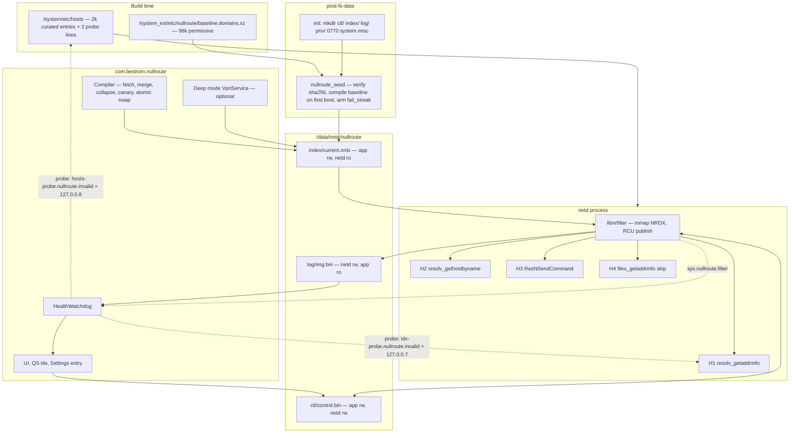

# Nullroute — Final Buildable Specification
### A resolver-native ad / tracker / malware blocker baked into BestROM (lineage-24.0 / Android 17, SM8635 peridot)
**Spec v1.0 — 2026-08-23 — supersedes the three competing designs**

---

## 1. Verdict

**Resolver-native wins.** The block decision lives inside `libnetd_resolv`, at the top of `resolv_getaddrinfo()`, reading an immutable mmap'd index from `/data/misc/nullroute/`. It is the only one of the three whose central mechanism survived all three judges: the hook site is real and the `uid` is real, it sits upstream of the hosts file, `res_cache` and every transport (so Private DNS strict does not defeat it and a ruleset change needs no cache flush), and it touches none of the SELinux third rails — no `mounton`, no netd binder, no `dnsresolver_service:service_manager find`, no app process in the DNS hot path. It costs zero battery, zero wakeups, zero VPN slot, has no boot race, covers every user and work profile, and is live before first unlock. **hosts-first loses on a verifiable point:** `neverallow { domain -init -otapreopt_chroot } { system_file_type vendor_file_type }:dir_file_class_set mounton;` in `system/sepolicy/private/domain.te` means only `init` may bind over `/system/etc/hosts`, and `sepolicy_tests.py::TestSystemTypeViolations` forbids relabelling the target to escape it — and the mount is redundant anyway once a `/data`-resident index exists. **vpn-first loses** because it accepts every structural VpnService limit (single slot, `onRevoke`, boot-race leak, strict-Private-DNS bypass, netd-not-app uid on the tun, nothing before first unlock) on a platform where we hold the privileges to avoid all of them — and because it wants `Vpn.java` + SystemUI patched to hide the VPN indicator, which is a security-behaviour change no maintainer should take.

**Every fatal flaw and factual error raised against the winner is fixed below, not waived. One is accepted.**

| # | Raised by | Defect | Resolution in this spec |
|---|---|---|---|
| F1 | Judge 1 (fatal) | `control.bin` lived under `log/` labelled `nullroute_log_file` with the app granted only `{open read getattr map}`, while the app is its sole writer → `mmap(PROT_WRITE)` fails `EACCES`; pause and all per-app policy silently dead | **Fixed.** Three separate labels: `nullroute_ctl_file` (`/data/misc/nullroute/ctl`, app **rw**, netd **rw**), `nullroute_index_file` (app rw, netd ro+`map`), `nullroute_log_file` (netd rw, app ro+`map`). `map` is spelled out on every rule. §5, §8.5 |
| F2 | Judge 1 (error) | `Binder.getCallingUid()` inside `onReceive()` returns the receiver's own uid → the `nrctl` privilege gate is a no-op | **Fixed.** `BroadcastReceiver.getSentFromUid()` (API 34+, A17 = 37) **and** `android:permission` on the receiver **and** `android:exported="true"` with an explicit uid allowlist `{0, 1000, 2000}`. §6.6 |
| F3 | Judge 1 (error) | `cc_library_shared{sdk_version:"current"}` depending on a platform-variant `cc_library_static` → Soong rejects | **Fixed.** `libnrjni` has **no** `sdk_version` (it is bundled inside a platform-signed app and needs no NDK variant). §5 |
| F4 | Judge 1 (error) | `system_ext_specific` on a `cc_library_static` is meaningless | **Fixed.** Removed. |
| F5 | Judge 1 (error) | Corpus claim about a `std::optional<int> app_socket` parameter contradicts AOSP main | **Fixed by construction.** Verified locally: the /e/OS `a16` fork **does** carry it (`getaddrinfo.cpp:472` passes `APP_SOCKET_NONE`, definition at `:485`), and the A17 tree inspection agrees; AOSP main may differ. The hook is therefore **signature-agnostic** — `nr_hook.h` exposes one inline taking only `(const char* hostname, uid_t uid)`. Build step 3 in §8 is `grep -n '^int resolv_getaddrinfo' getaddrinfo.cpp` and hook whichever definition carries the body. |
| F6 | Judges 1 & 3 (error) | "Tethered clients are filtered / arrive with netd's uid" — both assumed, neither verified; a UI row that does nothing | **Fixed.** Removed from the Apps screen. Tethering coverage is **Spike 4** (§10.6); until it returns, downstream lookups are bucketed under "System" and the docs say *unknown*. |
| F7 | Judge 2 (fatal) | netd's init stanza carries `onrestart restart zygote` → a matcher crash is a **UI/boot loop**, not a network outage | **Fixed, and re-scoped.** (a) The matcher has no allocation, no lock, no I/O, no recursion, hard label/length bounds; (b) **libFuzzer gate is a merge blocker**, fuzzing both the hostname and the index bytes; (c) **boot-loop breaker**: `nullroute_seed` arms `persist.sys.nullroute.fail_streak` at every `post-fs-data` and the app clears it after 120 s of healthy uptime — at 3 it quarantines `current.nrdx` and sets `kill=1`, so the third bad boot is clean; (d) `ro.nullroute.enabled=false` compiles the hooks out; (e) resolver self-disables after 3 map/validate faults. §6.1, §10.1 |
| F8 | Judge 2 (fatal) | `map_errors` lives *inside* the page whose mapping is the thing most likely to fail — the heartbeat cannot report its own death | **Fixed. Three independent signals, none of which transit the control page:** (1) the **dual `.invalid` probe** (grafted from hosts-first, upgraded to a *redirect* so it is unambiguous under `EAI_NONAME`); (2) netd `__system_property_set("sys.nullroute.filter", …)` at every state change, via `set_prop(netd, nullroute_state_prop)`; (3) a distinct logcat tag. Control-page counters are demoted to secondary telemetry. §3.4, §6.7 |
| F9 | Judge 2 (fatal) | Zero off-ROM value; the VpnService fallback is "optional, off by default" i.e. never built | **Fixed.** **Deep mode is a Phase 4 deliverable with acceptance criteria**, reusing the same index and matcher via JNI. It is what makes the APK work on stock Android and is the only thing that covers Chromium's built-in resolver. Off by default *on-ROM*; on by default when the APK detects no resolver hook. |
| F10 | Judge 2 (error) | `NrIndex.h` shipped as a "byte-identical copy" in two repos → silent drift across a rebase | **Fixed.** One `cc_library_headers { name: "libnrformat_headers", apex_available: ["//apex_available:platform", "com.android.resolv"] }` in `packages/apps/Nullroute/native/include/`, consumed by `libnetd_resolv` via `header_libs:`. §5, §8.3 |
| F11 | Judge 2 (error) | The `$(filter com.google.android.resolv,$(PRODUCT_PACKAGES))` guard misses `PRODUCT_COPY_FILES` / vendor `.mk` includes | **Fixed.** Guard also scans `PRODUCT_COPY_FILES` and `$(PRODUCT_PACKAGES)` for any `*resolv*.apex`, **plus** a post-build CI assertion on the built image. §8.9 |
| F12 | Judge 3 (fatal) | Chrome — and by extension WebView/Cronet — is not blocked; disclaimer-as-product | **Mitigated three ways, not waived.** (a) Deep mode filters Chrome's plaintext built-in resolver; (b) the baked L0 hosts file is the only free shot at Chromium's one-shot hosts read; (c) a **"Test my blocking"** self-test on the Home screen that proves or disproves it on *this* device instead of leaving the user to discover it. The Tier framing is corrected: **WebView and Cronet are Tier 2 alongside Chrome, pending Spike 5.** §3.6, §10.4 |
| F13 | Judge 3 (fatal) | Leaves `/system/etc/hosts` stock, so a missing hook means blocking exactly zero | **Fixed.** **L0: a curated ~2,000-entry permissive-licensed hosts core is baked into the image** (grafted from hosts-first Slice 0), sized so its linear scan is ~56 KB not 2.6 MB, plus a 2-line `hostsLayerSuperseded()` skip so it costs nothing when L1 is healthy. §3.2, §7.1 |
| F14 | Judge 3 (error) | "`UnknownHostException` → app treats it as network unavailable" overstates graceful degradation | **Fixed.** Copy corrected; `response_mode` is per-app configurable (`EAI_NONAME` / `EAI_NODATA` / sinkhole) precisely because some apps hard-fail on NXDOMAIN. §3.5 |
| F15 | Judge 3 (accepted) | No IP-layer / per-UID network firewall; RethinkDNS still wins on capability | **Accepted and scoped out.** Nullroute is a name-layer filter. Datura-class per-UID network policy is *complementary*; if BestROM wants it, it is a separate component. Stated in About. |

**Grafted in from the losing designs:** the baked hosts baseline + `50-lineage.sh` fix + slice-based shipping ladder + dual `.invalid` liveness probe + app-independent property kill switch + the graceful-degradation ladder + "Allow + retry → also Force stop app" (all **hosts-first**); the DNS-only fake-alias VpnService blueprint + the day-0 spike table + the `registerQuicConnectionClosePayload` mitigation + short-negative-TTL UX honesty + the blunt About-screen scope sentence (all **vpn-first**). Explicitly **refused** from vpn-first: any patch that hides the VPN key icon or the always-on notification.

---

## 2. Name & identity

| Thing | Value | One-line justification |
|---|---|---|
| Product name | **Nullroute** | Networking term of art; describes exactly what it does and reads as a system component, not a hobby module. |
| Package id | **`com.bestrom.nullroute`** | Verified against the existing in-tree app `com.bestrom.freezer` (`scratchpad/frz/Android.bp`) — one vendor prefix in the tree beats matching upstream Lineage's `org.lineageos.*`. |
| In-tree path | **`packages/apps/Nullroute/`** | Same shape as `packages/apps/Freezer`, whose `Android.bp` is already `mka`-verified in this tree. |
| Soong module | `Nullroute` | |
| Settings entry | **Network & internet → "Ad & tracker blocking"** | `com.android.settings.category.ia.network`, themed `Theme.SubSettingsBase.Expressive`. |
| QS tile label | **"Ad blocking"** | Subtitle = today's block count. |
| SELinux domain | `nullroute_app` | plus `nullroute_seed` |
| Native filter | `libnrfilter` (static, linked into `libnetd_resolv`) | |
| Shared headers | `libnrformat_headers` | Single source of truth for the on-disk format across both repos. |
| Index magic | `NRDX`, `NR_FMT_VERSION = 1` | |
| CLI | `nrctl` → `/system_ext/bin/nrctl` | |
| Boot seeder | `nullroute_seed` → `/system_ext/bin/nullroute_seed` | |
| State root | `/data/misc/nullroute/` | DE storage: live at `post-fs-data`, before first unlock, no `ENOKEY` window. |
| Persistent props | `persist.sys.nullroute.*` | `mode`, `kill`, `fail_streak`, `deep` |
| Volatile props | `sys.nullroute.*` | `filter` (written by netd), `seed` (written by the seeder) |
| DAC group | `misc` (AID 9998) | The app gets it via a permission→gid mapping in our own `/system_ext/etc/permissions/` XML, so `/data/misc/nullroute` can be `0770 system misc` without `sharedUserId=android.uid.system`. |

---

## 3. Architecture

### 3.1 Three enforcement layers

```
L0  BAKED HOSTS         build-time, /system/etc/hosts, ~2,000 curated entries
                        Always on. Zero code. Survives a dead hook, a dead index,
                        a dead app, recovery, and safe mode. Read by netd's
                        files_getaddrinfo -> _gethtent.

L1  RESOLVER HOOK       PRIMARY. libnrfilter inside libnetd_resolv, mmap'd NRDX
                        index. Wildcards, allowlist-wins, per-app policy, EAI_NONAME,
                        UID-attributed logging, instant pause. ~0.3-0.5 us/query,
                        zero heap, zero syscalls, zero wakeups.

L2  DEEP MODE           OPTIONAL, user-chosen. DNS-only VpnService with RFC 5737
                        in-tunnel aliases, reusing the SAME index via JNI.
                        Adds Chrome/Chromium plaintext coverage and makes the APK
                        work on non-BestROM devices. Takes the VPN slot; says so.
```

L1 supersedes L0 whenever it is healthy: the hook returns a tri-state and `files_getaddrinfo()` short-circuits, so the L0 scan costs nothing on a healthy device and is a real floor on a broken one.

### 3.2 Hook sites

| Site | File / function | Covers |
|---|---|---|
| **H1** | `getaddrinfo.cpp`, first statement of the `resolv_getaddrinfo()` **definition that carries the body** | ~99% of traffic: `getaddrinfo`, `InetAddress.getAllByName`, `Network.getAllByName`, `Socket`, `HttpURLConnection`, OkHttp-over-system-resolver, `DnsResolver.query()` |
| **H2** | `gethnamaddr.cpp`, first statement of `resolv_gethostbyname()` | legacy `gethostbyname()` callers — /e/OS forgot this one |
| **H3** | `DnsProxyListener.cpp`, the `ResNSendCommand` handler (**not** `res_nsend()` — hooking the external entry point avoids double-evaluating the resolver's own internal queries) | `android.net.DnsResolver.rawQuery()`; parse QNAME, synthesize `rcode=NXDOMAIN` echoing the question |
| **H4** | `getaddrinfo.cpp`, first statement of `files_getaddrinfo()` — **2 lines** | `if (nr::hostsLayerSuperseded()) return false;` — skips the L0 text scan when L1 is live, and honours `persist.sys.nullroute.kill` for L0 as well |

**No bionic twin patch.** `ANDROID_DNS_MODE=local` processes fail open, documented in §10.4. Reason: closing it needs `allow appdomain nullroute_index_file:file r_file_perms;`, which plausibly trips a CTS neverallow on `core_data_file_type` reads by untrusted apps, for a handful of processes.

### 3.3 The life of one DNS lookup, end to end

App `com.example.game` (uid 10234) calls `getaddrinfo("ads.doubleclick.net", …)`.

```
 1. APP PROCESS
    getaddrinfo()                              bionic/libc/dns/net/getaddrinfo.c
      -> android_getaddrinfofornetcontext()
      -> android_getaddrinfo_proxy()
      -> __netdClientDispatch.dnsOpenProxy()   libnetd_client.so
      -> connect(AF_UNIX, "/dev/socket/dnsproxyd")
      -> write "getaddrinfo ads.doubleclick.net ^ 0 0 1 0 0"

 2. NETD (SELinux domain netd, uid root)
    DnsProxyListener fills android_net_context {
        app_netid, app_mark, dns_netid, dns_mark,
        uid = 10234,          <- SO_PEERCRED on the dnsproxyd socket
        pid }
    -> resolv_getaddrinfo(hostname, servname, hints, &netcontext, ..., &res, &event)

 3. >>> H1: nr::evaluate(hostname, netcontext->uid) <<<
    3a  kill switch    cached __system_property_find + serial; if set -> PASS
    3b  generation     acquire-load ctl->want_generation (one hot cache line);
                       if != mapped_generation -> remap() [slow path, ~1x/day]
    3c  mode           ctl->mode != ENFORCE -> PASS               [0 ns]
    3d  per-app        ctl->uid_policy[10234] == EXEMPT -> PASS   [1 cache miss]
    3e  canonicalize   lowercase ASCII in place, strip trailing '.',
                       reject len>253 / label>63 / no '.' / inet_pton parses /
                       suffix in {.local .onion .arpa .localhost}
                       (NOTE: .invalid is deliberately NOT skipped - probes)
    3f  hash pass      ONE right-to-left FNV-1a pass, recording a mixed hash at
                       every label boundary:
                         d=1 "net"                 h[0]
                         d=2 "doubleclick.net"     h[1]
                         d=3 "ads.doubleclick.net" h[2]     D = 3
    3g  redirect       redirect_table.get(h[D-1])  -> miss     [1 cache miss,
                                                                page is L2-resident]
    3h  PASS A allow   most-specific first; allow filter+table ~72 KB, L2-resident
                       d=3 miss, d=2 miss  -> depth_allow = 0    [~20 ns]
    3i  PASS B block   most-specific first, short-circuits on first hit
                       d=3 block_filter.maybe(h[2]) -> no        [1 cache miss]
                       d=2 block_filter.maybe(h[1]) -> YES       [1 cache miss]
                           block_table.get(h[1]) -> {fp46, kind=SUFFIX, group=7}
                                                                 [1 cache miss]
                           kind_applies(SUFFIX, dep=2, D=3) -> true
                       depth_block = 2, group = 7 ("HaGeZi multi")
    3j  verdict        depth_block(2) > depth_allow(0) -> BLOCK
    3k  log            slot = atomic_fetch_add(&ring->head,1) % 4096;
                       write 64 B {ts_ms, uid, group, verdict, depth, name};
                       release-store seq.  Best-effort, never blocks. [~40 ns]
    3l  return         EAI_NONAME (default) / EAI_NODATA / sinkhole, per
                       ctl->response_mode and the app's per-uid override

    TOTAL: 4-6 cache misses ~= 0.3-0.5 us. Zero syscalls. Zero allocations.
           Zero locks. No res_cache entry created. No transport touched.

 4. DnsProxyListener writes the error back over dnsproxyd
 5. bionic returns EAI_NONAME
 6. app: java.net.UnknownHostException
```

If step 3j had returned PASS, control falls through to `explore_fqdn()` → **H4** short-circuits `files_getaddrinfo()` (L0 skipped, L1 is authoritative) → `dns_getaddrinfo()` → UDP/53, TCP/53, DoT or DoH3 as the network dictates.

### 3.4 Layered health signalling



**The three independent health signals** (F8). None of them transits `control.bin`, so a failed `mmap` of the control page cannot hide itself:

1. **Dual `.invalid` probe.** `InetAddress.getByName("idx-probe.nullroute.invalid")` must return **127.0.0.7** — this proves the hook fired *and* the index mapped *and* the redirect table parsed. `getByName("hosts-probe.nullroute.invalid")` must return **127.0.0.8** — this proves the L0 hosts layer is intact. They are *redirects*, not blocks, precisely because our default block response is `EAI_NONAME`, which is indistinguishable from a genuinely unresolvable `.invalid` name.
2. **`sys.nullroute.filter`**, set by netd at every state change: `ok:<gen>` / `nomap:<errno>` / `badhdr:<field>` / `killed` / `off`.
3. **logcat tag `NullrouteFilter`** with the exact `errno` on every failure path.

| Probe A (index) | Probe B (hosts) | Status card |
|---|---|---|
| 127.0.0.7 | 127.0.0.8 | **Protected** |
| fails | 127.0.0.8 | **Limited — running on the built-in list only.** Resolver filter not active. *(Diagnostics)* |
| 127.0.0.7 | fails | **Protected.** Built-in list missing — warn in Diagnostics, non-urgent. |
| fails | fails | **Not filtering.** Persistent, non-dismissible-until-tapped notification. |

### 3.5 Response semantics

Default **`EAI_NONAME`** — byte-identical to a real NXDOMAIN, zero connection attempts. It is *not* a "network unavailable" signal (F14): many apps surface `UnknownHostException` as a hard error or a retry loop, which is why `response_mode` is per-profile **and** per-app overridable:

- `EAI_NONAME` (default) — NXDOMAIN-equivalent.
- `EAI_NODATA` — "name exists, no A/AAAA". Gentler for apps that treat NXDOMAIN as fatal.
- **Sinkhole `0.0.0.0` / `::`** — compat only, per-app, off by default. ⚠️ Linux `connect()` to `0.0.0.0` is treated as `INADDR_LOOPBACK`, so the app connects to itself. This is a documented trap, offered as an escape hatch, never a default.

Blocked answers never enter `res_cache`, so un-blocking is instantaneous *at the resolver*. In-app caches (OkHttp, Chromium, JVM negative TTL) are not ours to flush — `neverallow … dnsresolver_service:service_manager find` means we cannot even reach `IDnsResolver.flushNetworkCache`. Therefore **every "Allow" action also offers "Force stop app"**, and the UI says *"the app may need to be reopened."*

### 3.6 Honest scope, stated on the Home screen

> **Nullroute blocks ad, tracker and malware domains for apps that use Android's system resolver.** It does not block ads served from the same domain as the content (YouTube, Instagram, Spotify), and it does not filter Chrome or other apps that run their own DNS — **turn on Deep mode for those.**

**Tier 1 (covered):** every app resolving through `getaddrinfo`/`gethostbyname`/`DnsResolver`, including all their embedded ad SDKs; all users and work profiles; before first unlock; on first boot with no network. Unaffected by Private DNS in either mode.
**Tier 2 (not covered by L1):** Chromium-family browsers, **Android WebView and Cronet/`HttpEngine`** (F12 — all three pending Spike 5, assume bypassed), apps shipping their own DoH/DoT/DoQ, hardcoded IP literals, domain fronting, first-party ad serving, `ANDROID_DNS_MODE=local` processes, VoWiFi/IMS, third-party VPN tunnels. Deep mode covers the plaintext subset of the first three.

---

## 4. Phased delivery

### Phase 0 — Baked floor. **2–3 days. Ships in the next BestROM build.**

**Ships:** a curated ~2,000-entry `/system/etc/hosts` (permissive licences only) with `overrides: ["etc_hosts"]`; the `hosts-probe.nullroute.invalid` line; removal of `etc/hosts` from `vendor/lineage/prebuilt/common/bin/50-lineage.sh`; the `registerQuicConnectionClosePayload` mitigation. **No app, no patches, no sepolicy, no runtime cost.**

**Blocks:** ~2,000 highest-value ad/tracker endpoints, for every app on the system resolver, forever, including in recovery-adjacent states and safe mode.
**Cannot block:** anything not on the list; no wildcards; no per-app rules; no pause; no updates without an OTA. Sinkholes to `0.0.0.0` (the loopback trap applies).

**Verify:**
```bash
mka etc_hosts Nullroute_etc_hosts && wc -l out/target/product/peridot/system/etc/hosts   # ~2003
adb shell wc -l /system/etc/hosts
adb shell getent hosts hosts-probe.nullroute.invalid                  # 127.0.0.8
adb shell ping -c1 doubleclick.net                                    # 0.0.0.0
adb shell 'device_config get tethering close_quic_connection'         # -1
```

### Phase 1 — MVP: resolver hook + index. **12–18 days.**

**Ships:** `libnrformat_headers`, `libnrfilter`, H1/H2/H4 (H3 deferred), the full sepolicy set, `init.nullroute.rc`, `nullroute_seed`, `baseline.domains.xz`, the boot-loop breaker, the kill switch, `sys.nullroute.filter`, both probes, and a **four-screen app**: Home (status + probes + pause), Profile picker, Update now, Diagnostics. Plus `nrctl status|pause|resume|update|query|verify`.

**Blocks:** everything Tier 1, with wildcards, allowlist-wins precedence, instant pause, and the 98k permissive baseline compiled on first boot with zero network.
**Cannot block:** Tier 2. No per-app rules, no user rules UI, no log, no auto-update scheduling, no importers.

**Verify (this is the make-or-break gate, §10.7):**
```bash
adb shell grep libnetd_resolv /proc/$(adb shell pidof netd)/maps
adb shell strings /apex/com.android.resolv/lib64/libnetd_resolv.so | grep -c NRDX   # >0
adb shell pm list packages --apex-only --show-versioncode | grep -i resolv          # com.android.resolv
adb shell getprop sys.nullroute.filter                                             # ok:<gen>
adb shell getent hosts idx-probe.nullroute.invalid                                 # 127.0.0.7
adb shell getent hosts sub.deep.ads.doubleclick.net                                # fails (wildcard)
adb shell /system_ext/bin/nrctl status
adb shell setprop persist.sys.nullroute.kill 1 && adb shell ping -c1 doubleclick.net  # resolves
adb shell setprop persist.sys.nullroute.kill 0
adb shell dmesg | grep -i 'avc.*nullroute'                                         # empty
```

### Phase 2 — The product. **10–16 days.**

**Ships:** source catalogue + `Range: bytes=0-511` version probe + conditional GETs; the three-file profile model; the full compile pipeline (external merge, suffix collapse, ABP `@@` handling, category toggles, user-rule overlay, canary, atomic swap, rollback); `JobScheduler`; Rules screen with live "this pattern matches N entries"; Query screen answering *which rule, at what depth, from which source*; Apps screen with per-app policy; Categories with FP-risk chips; the anti-fraud / attribution carve-out; the compiled-in `ALLOW_FORCE` never-block floor; the hotfix allow feed; QS tile; Settings injection.

**Blocks:** full Re-Malwack parity on Tier 1, plus per-app rules and pattern-persistent wildcard allowlisting that Re-Malwack structurally cannot do.
**Cannot block:** Tier 2.

**Verify:** profile switch → `nrctl query ads.doubleclick.net` names the source; `@*.doubleclick.net` then `nrctl update` and the allow survives; canary regression aborts a promotion; `nrctl rollback` restores; kill the update job mid-write and confirm `current.nrdx` is untouched; `dumpsys batterystats --reset` → fixed workload → `--charged com.bestrom.nullroute` shows **CPU time and wakeup count** indistinguishable from noise.

### Phase 3 — Logging, recovery, tooling. **7–10 days.**

**Ships:** H3; the MPSC ring in netd; `RingReader` → CE-storage SQLite; Log screen with per-app / per-domain aggregation; one-tap **Allow + retry (+ Force stop app)**; the **breakage notifier** (≥5 blocks in ≤10 s from the foreground app → "Nullroute blocked 6 requests from Bank. Tap to exempt", rate-limited once per app per day); AdAway / bindhosts / generic importers; settings export/import; full `nrctl`; Diagnostics bundle with domain redaction.

### Phase 4 — Deep mode + self-test. **8–12 days.**

**Ships:** the DNS-only `VpnService` (RFC 5737 aliases, `/32` routes on the DNS servers only, both address families, a real TCP/53 server, **no `allowBypass()`**), reusing `libnrjni`; the **"Test my blocking"** self-test; a stock-Android build variant (Gradle, `prepare()` consent path, no privapp XML).

**Blocks additionally:** Chromium's *plaintext* built-in resolver, and every app in the tunnel that does not run its own encrypted DNS.
**Cannot block:** in-app DoH/DoT to hardcoded IPs; first-party ads; anything while a third-party VPN holds the slot.
**Verify:** `chrome://net-internals/#dns` with a known-blocked domain, Deep off then on; IPv6-only/464XLAT carrier; a large TCP/53 answer; captive portal; work profile.

### Phase 5 — Optional depth. **5–8 days.**

CNAME uncloaking in the response path of `dns_getaddrinfo()`; `(userId, appId)` sparse per-user policy overrides; the L0 `hostsLayerSuperseded()` perf skip if not already landed.

---

## 5. Repository layout

```
packages/apps/Nullroute/
├─ Android.bp                                   # all Soong modules (see §8.6)
├─ SPEC.md                                      # this document
├─ build.gradle.kts / settings.gradle.kts       # Gradle parity build (fast compile check + stock-Android variant)
├─ gradle.properties · gradlew · gradlew.bat · gradle/
│
├─ native/                                      # shared by resolver, app, CLI, seeder
│  ├─ include/
│  │  ├─ NrIndex.h                              # ON-DISK FORMAT — the single source of truth (libnrformat_headers)
│  │  ├─ NrHash.h                               # FNV-1a-64 + mix, blocked-Bloom geometry, open-addressed probe seq
│  │  ├─ NrControl.h                            # struct NrControl, cache-line layout, mode/response/uid_policy
│  │  ├─ NrRing.h                               # struct NrLogRec, MPSC ring geometry
│  │  └─ NrVerdict.h                            # enum Verdict, RuleKind, kind_applies()
│  ├─ NrCanon.cpp                               # canonicalize + IP-literal reject + one right-to-left suffix-hash pass
│  ├─ NrQuery.cpp                               # evaluate() — THE matcher; shared byte-for-byte with the resolver
│  ├─ NrMap.cpp                                 # mmap, header/bounds validate, refcounted RCU publish, lazy backoff
│  ├─ NrParse.cpp                               # hosts / bare-domain / *.d.com / ABP (|| ^ and @@) / dnsmasq parsers
│  ├─ NrSort.cpp                                # external merge sort on reversed-label key, bounded RSS
│  ├─ NrCollapse.cpp                            # suffix collapse + dedupe with kind precedence
│  ├─ NrBuilder.cpp                             # k-way merge -> filter+tables -> staging file + sha256 + manifest
│  ├─ NrStrings.cpp                             # front-coded rule-text blob (UI only, never mapped by netd)
│  ├─ NrRingReader.cpp                          # read-only ring consumer with torn-record detection
│  ├─ NrCtl.cpp                                 # typed accessors over control.bin
│  ├─ jni_bridge.cpp                            # nativeBuild/Query/DrainRing/Canary/Verify/MatchCount
│  ├─ nrctl.cpp                                 # CLI: read verbs direct, mutating verbs via broadcast
│  ├─ nullroute_seed.cpp                        # boot: verify, first-boot compile, boot-loop breaker, kill honour
│  └─ fuzz/
│     ├─ nr_hostname_fuzzer.cpp                 # libFuzzer over arbitrary hostname bytes      [MERGE GATE]
│     └─ nr_index_fuzzer.cpp                    # libFuzzer over arbitrary index-file bytes    [MERGE GATE]
│
├─ resolver-patch/                              # applied to packages/modules/DnsResolver (§8.3)
│  ├─ nullroute/NrFilter.h                      # process-wide singleton, no lock
│  ├─ nullroute/NrFilter.cpp                    # generation watch, kill-switch cache, heartbeat, self-disable
│  ├─ nullroute/nr_hook.h                       # SIGNATURE-AGNOSTIC inline: nr_hook(hostname, uid) -> Verdict
│  ├─ nullroute/NrRingWriter.cpp                # MPSC producer (netd side)
│  ├─ 0001-nullroute-Android.bp.patch           # srcs + header_libs: ["libnrformat_headers"]
│  ├─ 0002-nullroute-H1-getaddrinfo.patch       # ~10 lines at the top of resolv_getaddrinfo + explore_numeric redirect
│  ├─ 0003-nullroute-H2-gethnamaddr.patch       # ~6 lines
│  ├─ 0004-nullroute-H4-files_getaddrinfo.patch # 2 lines: hostsLayerSuperseded()
│  └─ 0005-nullroute-H3-resnsend.patch          # ~40 lines, Phase 3
│
├─ app/src/main/
│  ├─ AndroidManifest.xml                       # no package= (AGP8); Soong genrule injects it
│  ├─ res/…                                     # layouts, drawables, xml/prefs, values(-night)
│  └─ java/com/bestrom/nullroute/
│     ├─ NullrouteApp.kt                        # DE-storage init, maps control.bin, starts watchdog
│     ├─ core/Native.kt                         # typed facade over libnrjni
│     ├─ core/ControlPage.kt                    # sole app-side writer of CL0 + uid_policy
│     ├─ core/Generation.kt                     # promote / rollback / previous.nrdx lifecycle
│     ├─ core/Paths.kt                          # every path constant; enforces the DE vs CE split
│     ├─ core/Probes.kt                         # the dual .invalid liveness probe
│     ├─ data/Profile.kt                        # base + _added + _removed tombstone overlay
│     ├─ data/ProfileStore.kt                   # profile files, "# DESC:", "# OFF #" markers
│     ├─ data/SourceCatalog.kt                  # built-in URLs, format hint, licence, bake-vs-fetch flag
│     ├─ data/RuleStore.kt                      # allow/deny/redirect, pattern syntax + validation
│     ├─ data/AppPolicyStore.kt                 # appId -> policy, writes straight into control.bin
│     ├─ data/Settings.kt                       # DataStore: mode, categories, schedule, retention, response
│     ├─ net/Downloader.kt                      # Range version probe, If-None-Match / If-Modified-Since, gzip/br
│     ├─ net/SourceSync.kt                      # orchestration; per-source failure is non-fatal and surfaced
│     ├─ net/HotfixFeed.kt                      # BestROM-hosted allow hotfixes, same schedule
│     ├─ build/IndexBuilder.kt                  # drives NrBuilder, emits typed BuildStep events
│     ├─ build/CanarySet.kt                     # must-allow / must-block, incl. live CAPTIVE_PORTAL_*_URL
│     ├─ build/NeverBlockFloor.kt               # compiled-in ALLOW_FORCE set
│     ├─ job/UpdateJobService.kt                # JobScheduler periodic refresh
│     ├─ job/BootReceiver.kt                    # LOCKED_BOOT_COMPLETED (DE-safe): probes + watchdog
│     ├─ job/HealthWatchdog.kt                  # probes + sys.nullroute.filter + heartbeat; clears fail_streak at 120 s
│     ├─ job/DeviceConfigFixups.kt              # close_quic_connection = -1
│     ├─ log/RingReader.kt · log/QueryLogDb.kt · log/Retention.kt
│     ├─ importer/AdAwayImporter.kt             # org.json, no bundled jq
│     ├─ importer/BindhostsImporter.kt · importer/HostsImporter.kt
│     ├─ export/SettingsArchive.kt              # SAF tar.gz of config, never logs
│     ├─ deep/DeepVpnService.kt                 # Phase 4: VpnService lifecycle
│     ├─ deep/TunnelBuilder.kt                  # RFC 5737 aliases, /32 routes, both families, NO allowBypass
│     ├─ deep/AliasPool.kt                      # alias <-> real upstream remap on network change
│     ├─ deep/TunLoop.kt                        # poll() over deviceFd + blockFd + N upstream sockets
│     ├─ deep/PacketCodec.kt                    # IPv4/IPv6 + UDP parse/emit, checksums
│     ├─ deep/DnsMessage.kt                     # DNS wire codec (QNAME, EDNS0)
│     ├─ deep/ResponseSynthesizer.kt            # NXDOMAIN + SOA MINIMUM=60, or A/AAAA sinkhole
│     ├─ deep/Tcp53Server.kt                    # TCP/53 (a /32 route captures the SYN too)
│     ├─ deep/DeepWatchdog.kt                   # failure counter persisted BEFORE establish(); auto-disable at 3/10min
│     ├─ selftest/BlockingSelfTest.kt           # "Test my blocking": in-app, WebView, browser
│     ├─ ctl/CtlReceiver.kt                     # getSentFromUid() gate for nrctl
│     ├─ notify/BreakageNotifier.kt · notify/DegradedNotifier.kt
│     ├─ qs/NullrouteTileService.kt · qs/TilePrefsActivity.kt
│     └─ ui/  MainActivity · SettingsEntryActivity · HomeFragment · ProfileFragment
│            · SourceEditFragment · CategoriesFragment · RulesFragment · QueryFragment
│            · LogFragment · AppPolicyFragment · DeepModeFragment · SettingsFragment
│            · DiagnosticsFragment · OnboardingActivity
│
├─ prebuilt/
│  ├─ hosts                                     # L0: stock 2 lines + 2 probe lines + ~2,000 curated (GENERATED)
│  ├─ baseline.domains.xz                       # 98k permissive-licensed, front-coded reversed-label
│  ├─ neverblock.txt                            # ALLOW_FORCE floor, compiled into every index
│  ├─ antifraud.txt · attribution.txt           # opt-in carve-out categories
│  └─ profiles/{lite,balanced,aggressive}.txt   # "URL # Name" + "# DESC:" header
│
├─ tools/
│  ├─ gen_l0_hosts.py                           # builds prebuilt/hosts from permissive sources
│  ├─ gen_baseline.py                           # builds baseline.domains.xz
│  └─ ci_verify_image.sh                        # post-build assertions on the built image (§8.9)
│
└─ rom/
   ├─ privapp-permissions-com.bestrom.nullroute.xml   # -> /system_ext/etc/permissions/
   ├─ nullroute-gid.xml                               # -> /system_ext/etc/permissions/  (permission -> gid misc)
   ├─ preinstalled-packages-platform-nullroute.xml    # -> /system_ext/etc/sysconfig/
   ├─ sysconfig-nullroute.xml                         # -> /system_ext/etc/sysconfig/  (power-save, data-saver)
   ├─ default-permissions-nullroute.xml               # -> /system_ext/etc/default-permissions/
   ├─ init.nullroute.rc                               # -> /system_ext/etc/init/
   ├─ sepolicy/
   │  ├─ nullroute.te            # file types + netd grants
   │  ├─ nullroute_app.te        # app domain
   │  ├─ nullroute_seed.te       # seeder domain
   │  ├─ nrctl.te                # shell/su read access
   │  ├─ file_contexts.frag      # append to device/lineage/sepolicy/common/private/file_contexts
   │  ├─ seapp_contexts.frag     # append (BEFORE any isPrivApp catch-all)
   │  ├─ property_contexts.frag  # append
   │  └─ property.frag           # append to property.te
   ├─ rro/NullrouteTileOverlay/  # adds the QS tile to config_defaultQuickSettingsTiles
   ├─ nullroute.mk               # -> vendor/bestrom/config/nullroute.mk
   └─ 50-lineage.sh.patch        # removes the etc/hosts line from the addon.d survival list
```

---

## 6. Core algorithms

### 6.1 (a) Suffix-walk match with allowlist-wins precedence — `native/NrQuery.cpp`

The canonical implementation. **The resolver and the app link this exact file**, so `nrctl query`, the Rules preview, the canary and the live filter can never disagree.

```cpp
// NrVerdict.h
enum RuleKind : uint8_t { K_SUFFIX = 0, K_WILDCARD_ONLY = 1, K_EXACT = 2, K_FORCE = 3 };
enum VerdictKind : uint8_t { V_PASS = 0, V_BLOCK = 1, V_REDIRECT = 2 };
struct Verdict { VerdictKind kind; uint8_t depth; uint16_t group; uint8_t family; uint8_t addr[16]; };

static inline bool kind_applies(RuleKind k, unsigned dep, unsigned D) {
    switch (k) {
        case K_SUFFIX:        return true;        // apex and all subdomains
        case K_WILDCARD_ONLY: return dep < D;     // subdomains only, NOT the apex
        case K_EXACT:         return dep == D;    // that FQDN only
        case K_FORCE:         return true;        // absolute allow, any depth
    }
    return false;
}

// NrQuery.cpp — no allocation, no lock, no I/O, no recursion. Every bound is hard.
Verdict nr_evaluate(const NrIndex& ix, const NrControl& ctl,
                    const char* name_in, size_t len, uid_t uid)
{
    Verdict v{}; v.kind = V_PASS;

    // ---- gates (each is one predictable branch) --------------------------------
    if (ctl.mode != MODE_ENFORCE)              return v;
    if (len == 0 || len > 253)                 return v;
    if (uid < 100000u * 10u) { /* fallthrough */ }
    if (ctl.uid_policy[uid % AID_USER_OFFSET] == POLICY_EXEMPT) return v;

    // ---- canonicalize onto a fixed stack buffer (NEVER in place on caller memory)
    char n[256]; size_t L = 0; bool has_dot = false;
    for (size_t i = 0; i < len; ++i) {
        char c = name_in[i];
        if (c >= 'A' && c <= 'Z') c = char(c - 'A' + 'a');
        if (c == '.') has_dot = true;
        n[L++] = c;
    }
    while (L > 0 && n[L-1] == '.') --L;            // strip trailing root dot
    if (L == 0 || !has_dot)                    return v;   // localhost, NetBIOS
    n[L] = '\0';
    if (nr_is_ip_literal(n))                   return v;   // inet_pton AF_INET/AF_INET6
    if (nr_has_skip_suffix(n, L))              return v;   // .local .onion .arpa .localhost
                                                           // NOTE: .invalid deliberately absent

    // ---- one right-to-left FNV-1a pass; a mixed hash at every label boundary ----
    uint64_t acc = ix.hdr.hash_seed;
    uint64_t h[NR_MAX_LABELS]; uint8_t D = 0;
    for (size_t i = L; i-- > 0; ) {
        acc = (acc ^ (uint8_t)n[i]) * 0x100000001b3ULL;
        if (n[i] == '.') {
            if (D >= NR_MAX_LABELS - 1) break;             // HARD BOUND (fuzz-critical)
            h[D++] = nr_mix(acc);                          // h[0]="com", h[1]="example.com", ...
        }
    }
    h[D++] = nr_mix(acc);                                  // the whole name
    // h[D-1] is the full FQDN; depth of h[k] is k+1

    // ---- redirect table: exact FQDN only, single 4 KiB L2-resident page ---------
    if (ix.hdr.n_redirect) {
        NrRedir r;
        if (nr_redir_get(ix, h[D-1], &r)) {
            v.kind = V_REDIRECT; v.depth = D; v.family = r.family;
            __builtin_memcpy(v.addr, r.addr, 16);
            return v;
        }
    }

    // ---- PASS A: allow walk, most-specific first (~72 KB, L2-resident, ~20 ns) --
    unsigned depth_allow = 0;
    for (int d = D - 1; d >= 0; --d) {
        unsigned dep = (unsigned)d + 1;
        if (dep > ix.hdr.max_labels || dep < ix.hdr.min_labels)      continue;
        if (!(ix.hdr.label_mask & (1u << (dep < 15 ? dep : 15))))    continue;
        if (!nr_bloom_maybe(ix.allow_filter, ix.hdr.sec[SEC_AF].len, h[d])) continue;
        NrSlot s;
        if (!nr_table_get(ix.allow_table, ix.hdr.at_cap, h[d], &s))  continue;
        if (!kind_applies((RuleKind)s.kind, dep, D))                 continue;
        if (s.kind == K_FORCE) return v;                 // absolute: beats any block
        depth_allow = dep; break;                        // deepest allow wins
    }
    if (depth_allow == D) return v;                      // nothing can out-specify it

    // ---- PASS B: block walk, most-specific first, short-circuits ---------------
    for (int d = D - 1; d >= 0; --d) {
        unsigned dep = (unsigned)d + 1;
        if (dep <= depth_allow) break;                   // nothing shallower can win
        if (dep > ix.hdr.max_labels || dep < ix.hdr.min_labels)      continue;
        if (!(ix.hdr.label_mask & (1u << (dep < 15 ? dep : 15))))    continue;
        if (!nr_bloom_maybe(ix.block_filter, ix.hdr.sec[SEC_BF].len, h[d])) continue;
        NrSlot s;
        if (!nr_table_get(ix.block_table, ix.hdr.bt_cap, h[d], &s))  continue;
        if (!kind_applies((RuleKind)s.kind, dep, D))                 continue;
        v.kind = V_BLOCK; v.depth = (uint8_t)dep; v.group = s.rule_group;
        return v;
    }
    return v;   // PASS
}
```

**Precedence, normative:**
1. `!domain` (`K_FORCE`) beats everything at any depth — this is the never-block floor and the captive-portal set.
2. A user `REDIRECT` on the exact FQDN beats block and allow.
3. Otherwise **more specific wins**: `block example.com` + `allow cdn.example.com` → `cdn.example.com` passes, `ads.example.com` blocks.
4. **Ties go to allow**: `block ads.net` + `allow ads.net` → passes (Pass A runs first and `depth_allow == D` short-circuits).

**Why two passes, not one interleaved:** an interleaved walk short-circuits on the first *block* and would never see a shallower `K_FORCE`. The allow structures total ~72 KB and stay L2-resident, so a full allow pass costs ~20 ns. Correct semantics for free.

**Why it is fast:** 96% of blocklist entries are ≤3 labels and BALANCED has no entry deeper than 10, so `label_mask` + `max_labels` skip 60–70% of probes on deep hostnames. Real hostnames are 3–4 labels → 2–3 block probes → ~300 ns.

**Kill switch (cached, not per-query property read — this is the fix for DivestOS's `GetIntProperty`-per-call):**

```cpp
// NrFilter.cpp
static const prop_info* g_pi = nullptr;
static uint32_t g_serial = 0;
static bool     g_kill   = false;

static inline void nr_refresh_kill() {
    if (__builtin_expect(g_pi == nullptr, 0)) {
        g_pi = __system_property_find("persist.sys.nullroute.kill");
        if (!g_pi) { g_kill = false; return; }
        g_serial = ~0u;
    }
    uint32_t s = __system_property_serial(g_pi);   // one atomic load in the shared mapping
    if (s == g_serial) return;                     // the common case: nothing to do
    g_serial = s;
    __system_property_read_callback(g_pi,
        [](void* c, const char*, const char* val, uint32_t) {
            *(bool*)c = (val[0] == '1');
        }, &g_kill);
}
```

**Boot-loop breaker (F7).** `nullroute_seed`, every `post-fs-data`:

```
prev_ok    = getprop persist.sys.nullroute.boot_ok      # set to 1 by the app at T+120 s
streak     = getprop persist.sys.nullroute.fail_streak
if prev_ok != "1":  streak += 1  else: streak = 0
setprop persist.sys.nullroute.fail_streak <streak>
setprop persist.sys.nullroute.boot_ok 0                 # arm for this boot
if streak >= 3:
    rename index/current.nrdx -> index/quarantine.nrdx
    setprop persist.sys.nullroute.kill 1
    setprop sys.nullroute.seed "quarantined"
    exit 0                                              # third bad boot is clean
```
A zygote restart loop never lets the app reach 120 s of healthy uptime, so the streak advances and the third boot is unfiltered.

### 6.2 (b) Wildcard allowlist matcher

**The single most important correction to Re-Malwack.** Re-Malwack's `-w add "*.doubleclick.net"` expands to the concrete domains present at that instant, persists only those, and silently stops working after the next list update. Nullroute stores the *pattern*.

**Pattern syntax → table kind (compile time):**

```kotlin
// data/RuleStore.kt
sealed class Pattern {
    data class Suffix (val d: String) : Pattern()   // example.com     -> K_SUFFIX
    data class Wild   (val d: String) : Pattern()   // *.example.com   -> K_WILDCARD_ONLY
    data class Exact  (val d: String) : Pattern()   // =a.example.com  -> K_EXACT
}

private val LABEL = Regex("^[a-z0-9](?:[a-z0-9-]{0,61}[a-z0-9])?$")

/** Returns null with a user-facing reason if the pattern is not admissible. */
fun parseAllow(raw: String): Result<Pair<Pattern, RuleKind>> {
    var s = raw.trim().lowercase().removeSuffix(".")
    var force = false
    if (s.startsWith("!")) { force = true; s = s.substring(1) }
    if (s.startsWith("@"))  { s = s.substring(1) }          // '@' is optional in the allow list UI
    val kind: RuleKind
    when {
        s.startsWith("*.") -> { kind = if (force) RuleKind.K_FORCE else RuleKind.K_WILDCARD_ONLY
                                s = s.removePrefix("*.") }
        s.startsWith("=")  -> { kind = RuleKind.K_EXACT;  s = s.removePrefix("=") }
        else               -> { kind = if (force) RuleKind.K_FORCE else RuleKind.K_SUFFIX }
    }
    // Deliberately NOT supported, and rejected with an explanation rather than
    // silently mis-handled the way Re-Malwack's three divergent regex builders do:
    if (s.contains('*')) return Result.failure(
        BadPattern("Only a leading \"*.\" is supported. " +
                   "\"ads*\" and \"*ads.net\" cannot be evaluated by a suffix index; " +
                   "list the domains, or use a broader suffix."))
    val labels = s.split('.')
    if (labels.size < 2)  return Result.failure(BadPattern("Needs at least two labels."))
    if (labels.any { !LABEL.matches(it) })
        return Result.failure(BadPattern("Not a valid domain label: \"$s\"."))
    if (s.length > 253)   return Result.failure(BadPattern("Too long."))
    return Result.success(toPattern(kind, s) to kind)
}
```

**Query-time evaluation is already done** — `nr_evaluate` Pass A + `kind_applies` *is* the wildcard matcher. There is no expansion step and nothing to go stale.

**Live "this pattern matches N entries" preview** (Rules screen) — the honest version of what Re-Malwack does destructively:

```kotlin
/** Counts current index entries a pattern would neutralise. Read-only; the index is untouched. */
fun previewMatches(p: Pattern): MatchPreview {
    val (kind, base) = normalize(p)
    // NrStrings.cpp holds the front-coded rule text in reversed-label order, so every
    // rule under a suffix is a contiguous range: one binary search + a linear walk.
    val range = Native.stringsRangeForSuffix(base)          // O(log n + k)
    var apex = 0; var subs = 0
    Native.forEachInRange(range) { rule ->
        if (rule == base) apex++ else subs++
    }
    return when (kind) {
        RuleKind.K_SUFFIX, RuleKind.K_FORCE -> MatchPreview(apex + subs, "$base and all subdomains")
        RuleKind.K_WILDCARD_ONLY            -> MatchPreview(subs,        "subdomains of $base only")
        RuleKind.K_EXACT                    -> MatchPreview(apex,        "exactly $base")
    }
}
```

**Removal** is `rm` of the pattern from `allow.txt` plus a rebuild of the allow tables only (~1 s) — never the three divergent regex builders Re-Malwack uses for add / guard / remove.

### 6.3 (c) Atomic blocklist swap

**Writer** (`core/Generation.kt`, after `NrBuilder` has produced `staging.<gen>.nrdx` and the canary passed):

```kotlin
fun promote(gen: Long): PromoteResult {
    val staging  = Paths.index.resolve("staging.$gen.nrdx")
    val current  = Paths.index.resolve("current.nrdx")
    val previous = Paths.index.resolve("previous.nrdx")

    // 0. Pre-flight: never half-write into a full /data.
    val need = staging.length() * 2 + (4L shl 20)
    if (StatFs(Paths.misc.path).availableBytes < need) return PromoteResult.NoSpace(need)

    // 1. Structural + cryptographic verification of the artefact we are about to hand netd.
    if (!Native.verify(staging.path))          return PromoteResult.Corrupt("verify failed")
    // 2. ABI gate: refuse to promote an index the INSTALLED resolver cannot read.
    val abi = ControlPage.filterAbi()                    // written by the resolver's heartbeat
    if (abi != 0 && Native.formatVersion(staging.path) > abi)
        return PromoteResult.AbiTooNew(abi)
    // 3. Behavioural gate: the canary uses the SAME NrQuery.cpp the resolver uses.
    val canary = Native.canary(staging.path, CanarySet.build(context))
    if (!canary.ok)                            return PromoteResult.CanaryFailed(canary.firstFailure)
    // 4. Sanity: a source that lost 90% of its entries is a truncated download, not an update.
    if (!EntryCountSanity.ok(gen))             return PromoteResult.SanityFailed

    // 5. Publish. link() then rename() are both atomic within the filesystem.
    Os.remove(previous.path).ignoreEnoent()
    if (current.exists()) Os.link(current.path, previous.path)
    Os.rename(staging.path, current.path)                // ATOMIC: readers see old or new, never torn
    FileUtils.fsyncDirectory(Paths.index)

    // 6. Release-store the generation. The resolver's next query picks it up.
    ControlPage.setWantGeneration(gen)                   // VarHandle.setRelease
    return PromoteResult.Ok
}
```

**Reader** (`resolver-patch/nullroute/NrFilter.cpp`) — lock-free RCU, no `inotify`, no fd added to netd:

```cpp
class NrFilter {
    std::atomic<NrMapping*> cur_{nullptr};      // refcounted, released by the last reader
    NrControl* ctl_{nullptr};                   // MAP_SHARED, 128 KiB
    uint64_t   mapped_gen_{0};
    unsigned   faults_{0};

public:
    Verdict evaluate(const char* host, uid_t uid) {
        nr_refresh_kill();
        if (__builtin_expect(g_kill, 0)) return Verdict{V_PASS};
        if (__builtin_expect(ctl_ == nullptr, 0)) return Verdict{V_PASS};   // fail OPEN

        // ONE already-hot cache line. Effectively free.
        uint64_t want = __atomic_load_n(&ctl_->want_generation, __ATOMIC_ACQUIRE);
        if (__builtin_expect(want != mapped_gen_, 0)) remap(want);          // ~1x/day

        NrMapping* m = cur_.load(std::memory_order_acquire);
        if (__builtin_expect(m == nullptr, 0)) return Verdict{V_PASS};      // fail OPEN
        NrRef ref(m);                                                       // refcount++ / --
        Verdict v = nr_evaluate(ref->index, *ctl_, host, strlen(host), uid);
        __atomic_fetch_add(&ctl_->q_total, 1, __ATOMIC_RELAXED);
        if (v.kind == V_BLOCK) __atomic_fetch_add(&ctl_->q_blocked, 1, __ATOMIC_RELAXED);
        return v;
    }

    // hostsLayerSuperseded(): H4 skips the L0 text scan iff L1 is authoritative.
    bool hostsLayerSuperseded() const {
        return !g_kill && cur_.load(std::memory_order_acquire) != nullptr;
    }

private:
    void remap(uint64_t want) {
        NrMapping* nm = NrMapping::open(NR_INDEX_CURRENT);   // open + fstat + mmap + validate
        if (!nm) {
            ++faults_;
            __atomic_fetch_add(&ctl_->map_errors, 1, __ATOMIC_RELAXED);
            ALOGE("NullrouteFilter: map failed errno=%d gen=%" PRIu64, errno, want);
            nr_set_state_prop("nomap:%d", errno);            // INDEPENDENT signal (F8)
            if (faults_ >= 3) {                              // self-disable, stay fail-open
                nr_set_state_prop("disabled");
                ctl_ = nullptr;
            }
            return;                                          // keep the PREVIOUS mapping live
        }
        NrMapping* old = cur_.exchange(nm, std::memory_order_acq_rel);
        if (old) old->release();     // valid until its last in-flight reader drops it
        mapped_gen_ = nm->generation();
        faults_ = 0;
        __atomic_store_n(&ctl_->mapped_generation, mapped_gen_, __ATOMIC_RELEASE);
        __atomic_store_n(&ctl_->last_map_ms, nr_now_ms(), __ATOMIC_RELEASE);
        ctl_->filter_abi = NR_FMT_VERSION;
        nr_set_state_prop("ok:%" PRIu64, mapped_gen_);
    }
};
```

**No query is dropped and no query ever observes a half-written file.** The old mapping stays valid until its last in-flight reader releases it.

**Pause/resume is one byte** in `ctl->mode`, persistently mirrored to `persist.sys.nullroute.mode` by the app and synced back by an init `on property:` trigger. The **property is the single source of truth on disk**; `ctl->mode` is derived from it. Two authorities can never disagree about a boolean (judge 3's objection to hosts-first's twin switches).

**Degradation ladder**, announced at every step, never silent:

```
current.nrdx  ->  previous.nrdx  ->  baseline (recompiled by seed)  ->  L0 hosts only  ->  PASS-ALL
```

### 6.4 (d) Deep mode: DNS packet parse + NXDOMAIN synthesis — `deep/`

Only reached in Phase 4. The tunnel captures **only** `/32`-routed traffic to the in-tunnel aliases, so the parser sees DNS and nothing else.

```kotlin
// deep/TunnelBuilder.kt — RFC 5737 / RFC 3849 aliases; collision-proof by construction.
fun build(vpn: VpnService, upstreams: List<InetAddress>): ParcelFileDescriptor {
    val b = vpn.Builder().setSession("Nullroute Deep").setMtu(1500)
    var v4fmt: String? = null
    for (p in arrayOf("192.0.2", "198.51.100", "203.0.113")) {
        try { b.addAddress("$p.1", 24); v4fmt = "$p.%d"; break }
        catch (e: IllegalArgumentException) { /* in use by the physical net; try next */ }
    }
    b.addAddress("2001:db8::1", 120)
    aliasPool.reset(v4fmt!!, "2001:db8::%x")
    upstreams.forEachIndexed { i, real ->
        val alias = aliasPool.aliasFor(i, real)      // NEVER loopback: addDnsServer() rejects
        b.addDnsServer(alias)                        //   loopback and any-local addresses
        b.addRoute(alias, if (alias is Inet6Address) 128 else 32)
    }
    b.allowFamily(OsConstants.AF_INET); b.allowFamily(OsConstants.AF_INET6)
    // b.allowBypass() is DELIBERATELY NOT CALLED — DNS66 calls it and inherits a
    // filter any app can escape with Network.bindSocket().
    return b.establish() ?: throw IllegalStateException("establish() returned null")
}
```

```kotlin
// deep/DnsMessage.kt — minimal, bounds-checked wire codec.
class DnsMessage(val buf: ByteArray, val off: Int, val len: Int) {
    val id      get() = u16(0)
    val flags   get() = u16(2)
    val qdCount get() = u16(4)
    val isQuery get() = (flags and 0x8000) == 0
    val opcode  get() = (flags ushr 11) and 0xF

    /** Reads QNAME with compression-pointer rejection (a query must not use them). */
    fun qname(): Pair<String, Int>? {
        var p = off + 12
        val sb = StringBuilder(64)
        var labels = 0
        while (true) {
            if (p >= off + len) return null
            val l = buf[p].toInt() and 0xFF
            if (l == 0) { p++; break }
            if (l and 0xC0 != 0) return null                 // pointer in a question: malformed
            if (l > 63 || ++labels > 127) return null
            if (p + 1 + l > off + len) return null
            if (sb.isNotEmpty()) sb.append('.')
            for (i in 0 until l) {
                val c = (buf[p + 1 + i].toInt() and 0xFF).toChar()
                sb.append(if (c in 'A'..'Z') c + 32 else c)
            }
            p += 1 + l
        }
        if (p + 4 > off + len) return null
        if (sb.length > 253) return null
        return sb.toString() to p                            // p points at QTYPE
    }
    fun qtype(qEnd: Int)  = ((buf[qEnd].toInt() and 0xFF) shl 8) or (buf[qEnd+1].toInt() and 0xFF)
    private fun u16(i: Int) = ((buf[off+i].toInt() and 0xFF) shl 8) or (buf[off+i+1].toInt() and 0xFF)
}
```

```kotlin
// deep/ResponseSynthesizer.kt
object ResponseSynthesizer {
    private const val NEG_TTL = 60          // short, so an "Allow" takes effect within a minute
    private const val RCODE_NXDOMAIN = 3

    /** NXDOMAIN with an SOA in AUTHORITY so resolvers honour a bounded negative cache. */
    fun nxdomain(q: DnsMessage, qEnd: Int): ByteArray {
        val qLen = qEnd + 4 - (q.off + 12)                  // QNAME + QTYPE + QCLASS
        val out  = ByteArrayOutputStream(12 + qLen + 64)
        val d    = DataOutputStream(out)
        d.writeShort(q.id)
        d.writeShort(0x8180 or RCODE_NXDOMAIN)              // QR=1 RD=1 RA=1 rcode=3
        d.writeShort(1); d.writeShort(0); d.writeShort(1); d.writeShort(0)   // QD AN NS AR
        d.write(q.buf, q.off + 12, qLen)                    // echo the question verbatim
        // AUTHORITY: <qname> IN SOA nullroute.invalid. block.nullroute.invalid. 1 3600 600 86400 60
        writeName(d, q.buf, q.off + 12, qEnd)
        d.writeShort(6); d.writeShort(1); d.writeInt(NEG_TTL)
        val rd = ByteArrayOutputStream(); val rdo = DataOutputStream(rd)
        writeLabels(rdo, "nullroute.invalid"); writeLabels(rdo, "block.nullroute.invalid")
        rdo.writeInt(1); rdo.writeInt(3600); rdo.writeInt(600); rdo.writeInt(86400); rdo.writeInt(NEG_TTL)
        d.writeShort(rd.size()); d.write(rd.toByteArray())
        return out.toByteArray()
    }

    /** Sinkhole variant, used only for per-app compat mode and for the .invalid probes. */
    fun sinkhole(q: DnsMessage, qEnd: Int, addr: InetAddress): ByteArray { /* A/AAAA, ttl=NEG_TTL */ }
}
```

```kotlin
// deep/TunLoop.kt — the hot loop. No userspace TCP stack for anything but port 53.
private fun onDatagram(pkt: IpPacket) {
    val dns = DnsMessage(pkt.payload, pkt.payloadOff, pkt.payloadLen)
    if (!dns.isQuery || dns.opcode != 0 || dns.qdCount != 1) { forwardUpstream(pkt); return }
    val (name, qEnd) = dns.qname() ?: run { forwardUpstream(pkt); return }

    // Standard mode cannot reliably attribute a uid here: in the getaddrinfo path the
    // packet is emitted by netd, not by the app (Spike 1). uid is best-effort only.
    val uid = runCatching {
        cm.getConnectionOwnerUid(OsConstants.IPPROTO_UDP, pkt.srcSock(), pkt.dstSock())
    }.getOrDefault(Process.INVALID_UID)

    when (val v = Native.query(name, uid)) {                 // SAME index, SAME matcher
        is V.Redirect -> reply(pkt, ResponseSynthesizer.sinkhole(dns, qEnd, v.addr))
        is V.Block    -> {
            log(name, uid, v.group)
            reply(pkt, if (responseModeFor(uid) == SINKHOLE)
                         ResponseSynthesizer.sinkhole(dns, qEnd, ANY_LOCAL)
                       else ResponseSynthesizer.nxdomain(dns, qEnd))
        }
        is V.Pass     -> forwardUpstream(pkt)                // via a protect()-ed socket
    }
}
```

A `/32` route captures the TCP SYN too, so `Tcp53Server` accepts on the alias, reads the 2-byte length prefix, and applies the identical decision — omitting it silently breaks large/EDNS-fallback lookups.

### 6.5 (e) Blocklist compile / index step — `native/NrBuilder.cpp` driven by `build/IndexBuilder.kt`

```
compile(profile, categories, userRules, addons) -> staging.<gen>.nrdx

 1. VERSION PROBE, per enabled source. ~600 bytes decides whether to pull 4 MB.
      GET url, Range: bytes=0-511, Cache-Control: no-cache
      raw.githubusercontent -> 206 + weak ETag (no Last-Modified) -> use If-None-Match
      GH Pages / hagezi mirror -> ETag + Last-Modified            -> use If-Modified-Since
      jsDelivr -> br, max-age=604800  -> ALWAYS send no-cache on the probe or you serve
                                         week-old lists
      OISD -> rejects Range with 416  -> HEAD + ETag instead
      Compare the "# Version:" / "# Number of entries:" line to the compiled manifest.

 2. FETCH only changed sources, gzip/br on the wire, into priv/cache/<sha1(url)>.raw.gz.
    A per-source failure is NON-FATAL and is surfaced in the UI. Never silently zeroed.

 3. PARSE each source by format into normalized records (kind, punycode-lowered name, source_id):
      hosts          "0.0.0.0 a.com b.com"  -> ALL fields after the IP, not just $2
                                               (Re-Malwack drops everything after $2)
      bare domains   -> K_SUFFIX
      "*.d.com"      -> K_WILDCARD_ONLY
      ABP            "||d^" -> K_SUFFIX ; "@@||d^" -> ALLOW  (MANDATORY: flattening
                     AdGuard/OISD to bare domains manufactures FPs that do not exist
                     upstream) ; element-hiding rules (##, #@#, #?#) skipped
      dnsmasq        address=/d/ -> K_SUFFIX
    Reject anything failing the label regex; count and report rejects per source.

 4. EXTERNAL SORT each source on the reversed-label key, streaming, bounded RSS.
    NEVER build a HashSet<String>: 443k Java strings is 60-90 MB heap and Android 17's
    per-app memory limits will kill the job. k-way external merge holds RSS to 20-40 MB.

 5. K-WAY MERGE + DEDUPE with kind precedence (SUFFIX > WILDCARD_ONLY > EXACT).

 6. SUFFIX COLLAPSE: drop x.d.com when d.com is present as K_SUFFIX.
    Measured gain: -17.5% at BALANCED (274,412 -> 226,398), -25.1% at AGGRESSIVE
    (592,006 -> 443,145).

 7. OVERLAY, in this order (later wins):
      a. category add-ons
      b. user deny.txt          (pinned: survives profile switch and reset)
      c. user allow.txt         (patterns, NOT expansions)
      d. hotfix allow feed
      e. antifraud.txt + attribution.txt  -> ALLOW unless the user opted the category IN
      f. neverblock.txt as K_FORCE, PLUS the live values of
         Settings.Global.CAPTIVE_PORTAL_HTTP_URL / CAPTIVE_PORTAL_HTTPS_URL and the
         Lineage fallbacks, PLUS mtalk.google.com and alt[1-8]-mtalk.google.com
      g. the two .invalid probes as REDIRECT entries

 8. EMIT
      block_filter : blocked Bloom, 512-bit blocks (exactly one cache line), k=13
                     WITHIN the block, ~19.2 bits/key -> ONE cache miss per probe.
                     A textbook non-blocked Bloom with k=13 costs up to 13 misses.
      block_table  : open-addressed, pow2 >= 2*n, linear probe, 8-byte slots,
                     46-bit fingerprint (false-collision p ~ 8e-10 over 226k keys;
                     a 32-bit fingerprint would be ~5e-5, i.e. roughly a 1-in-10 chance
                     a device ever sees one spurious block).
      allow_filter/allow_table : same shape, ~72 KB total
      redirect_table           : one 4 KiB page
      header       : label_mask, min_labels, max_labels, hash_seed, section offsets
      sha256       over bytes [4096, EOF)
    Separately: strings.<gen>.nrdx (front-coded rule text, UI only) and
                manifest.<gen>.json (per-source counts, versions, licences).

 9. fsync(staging); fsync(dir)

10. CANARY against the staging blob using the SAME NrQuery.cpp the resolver links.
    must PASS: mtalk.google.com, alt1..8-mtalk.google.com, android.clients.google.com,
               www.googleapis.com, *.gstatic.com, *.gvt1.com, the live captive-portal
               URLs, the OEM update host, every user allow entry, and every domain
               resolved by apps the user marked critical in the last 7 days.
    must BLOCK: ~20 canonical ad/tracker domains for the selected profile.
    must REDIRECT: the two .invalid probes.
    Any regression -> ABORT, keep current.nrdx, notify with the exact failing domain.

11. PROMOTE (see 6.3).
```

**Scheduling:** plain `JobScheduler` + `JobService`, not WorkManager (which drags androidx + Room into a Soong build for no benefit; we are `allow-in-power-save` so we are not fighting the scheduler). `setRequiredNetworkType(NETWORK_TYPE_UNMETERED)`, `setRequiresBatteryNotLow(true)`, `setPeriodic(24h, 6h flex)`, `setBackoffCriteria(30min, EXPONENTIAL)`, `setEstimatedNetworkBytes(2_000_000, 4096)`, `setPersisted(true)`. Connectivity is `ConnectivityManager`/`NetworkCallback`, **never** `ping -c 1 8.8.8.8`.

### 6.6 `nrctl` privilege gate (F2)

```xml
<receiver android:name=".ctl.CtlReceiver"
          android:exported="true"
          android:permission="com.bestrom.nullroute.permission.CTL">
    <intent-filter><action android:name="com.bestrom.nullroute.action.CTL"/></intent-filter>
</receiver>
```
```kotlin
class CtlReceiver : BroadcastReceiver() {
    override fun onReceive(ctx: Context, i: Intent) {
        // Binder.getCallingUid() returns OUR uid here - there is no ongoing binder
        // transaction inside onReceive(). getSentFromUid() is the correct API (API 34+).
        val from = sentFromUid
        if (from != Process.SHELL_UID && from != Process.ROOT_UID && from != Process.SYSTEM_UID) {
            Log.w(TAG, "rejecting CTL from uid=$from pkg=$sentFromPackage"); return
        }
        CtlDispatcher.handle(ctx, i)
    }
}
```
Read-only `nrctl` verbs bypass the broadcast entirely and read the mmapped files directly (`shell` has read on `nullroute_index_file` / `nullroute_log_file` / `nullroute_ctl_file`).

### 6.7 The liveness probe (F8, grafted from hosts-first, upgraded)

```kotlin
object Probes {
    const val IDX   = "idx-probe.nullroute.invalid"      // REDIRECT in the index only
    const val HOSTS = "hosts-probe.nullroute.invalid"    // literal line in /system/etc/hosts only
    const val DEEP  = "vpn-probe.nullroute.invalid"      // synthesized by the tunnel only

    private fun resolves(n: String, expect: String) =
        runCatching { InetAddress.getByName(n).hostAddress == expect }.getOrDefault(false)

    fun sample(): Health = Health(
        resolverHookLive = resolves(IDX,   "127.0.0.7"),
        hostsLayerLive   = resolves(HOSTS, "127.0.0.8"),
        deepModeLive     = resolves(DEEP,  "127.0.0.9"),
        stateProp        = SystemProperties.get("sys.nullroute.filter", "unknown"),
        heartbeat        = ControlPage.readHeartbeatOrNull()   // may be null - that's a signal
    )
}
```
Run on `LOCKED_BOOT_COMPLETED`, on Home-screen resume, and after every promotion. **`.invalid` is deliberately absent from the matcher's skip-suffix list.**

---

## 7. Data model

### 7.1 Files on disk

```
/system/etc/hosts                                       L0, build-time, read-only
    127.0.0.1 localhost
    ::1 ip6-localhost
    127.0.0.8 hosts-probe.nullroute.invalid
    0.0.0.0 <~2,000 curated permissive-licensed ad/tracker endpoints>
                                                        ~56 KB. Sized so the per-query
                                                        _gethtent linear scan is cheap, and
                                                        skipped entirely by H4 when L1 is live.

/system_ext/etc/nullroute/
    baseline.domains.xz          98k permissive domains, front-coded reversed-label, ~450 KB
    neverblock.txt               ALLOW_FORCE floor
    antifraud.txt attribution.txt
    profiles/{lite,balanced,aggressive}.txt

/data/misc/nullroute/            0771 system misc
  index/                         0770 system misc   label nullroute_index_file  (app rw, netd ro+map)
    current.nrdx                 the live blob
    previous.nrdx                last known-good
    staging.<gen>.nrdx           being written
    quarantine.nrdx              set aside by the boot-loop breaker
    strings.<gen>.nrdx           front-coded rule text; UI only, never mapped by netd
    manifest.<gen>.json          per-source counts, versions, licences
  ctl/                           0770 system misc   label nullroute_ctl_file    (app rw, netd rw)
    control.bin                  128 KiB shared control page
  log/                           0770 system misc   label nullroute_log_file    (netd rw, app ro+map)
    ring.bin                     256 KiB MPSC ring
  priv/                          0770 system misc   label nullroute_data_file   (app rw, netd none)
    sources.txt  allow.txt  deny.txt  redirect.txt
    profiles/<name>{,_added,_removed}.txt
    cache/<sha1(url)>.raw.gz

/data/user/0/com.bestrom.nullroute/databases/querylog.db     CE storage, deliberately
```

`control.bin` and `ring.bin` are **pre-created at the right size and ownership by `nullroute_seed`**; netd only ever `open()`s and `mmap()`s existing files, never creates. This removes every ownership/umask surprise (netd runs as root and would otherwise create root-owned files the app cannot touch).

**The DE/CE split is deliberate.** Index and control page in DE (`/data/misc`) → filtering is live at `post-fs-data`, before first unlock, no `ENOKEY` window. The *query log* in CE → a seized-but-locked device exposes no DNS history. Before first unlock the ring accumulates and may wrap; that is acceptable.

### 7.2 Index format `NRDX` v1

All sections 4 KiB-aligned, little-endian, immutable.

```c
#define NR_MAGIC        0x5844524E   /* "NRDX" */
#define NR_FMT_VERSION  1
#define NR_MAX_LABELS   16

struct NrHeader {                 /* page 0 */
    uint32_t magic;  uint16_t fmt_version;  uint16_t flags;
    uint64_t generation;          /* monotonic, set by the builder */
    uint64_t built_at_ms;
    uint32_t n_block, n_allow, n_redirect;
    uint32_t bt_cap, at_cap, rt_cap;   /* power-of-two table capacities */
    uint16_t label_mask;          /* bit d set == some rule has exactly d labels */
    uint8_t  min_labels, max_labels;
    uint64_t hash_seed;
    struct { uint64_t off, len; } sec[8];  /* BF, BT, AF, AT, RT, STR_OFF, rsv, rsv */
    uint8_t  sha256[32];          /* over bytes [4096, EOF) */
    uint64_t manifest_off, manifest_len;
};

/* one table slot, 8 bytes:
     bits 63..18  fp46        46-bit fingerprint of the suffix hash
     bits 17..16  kind        RuleKind
     bits 15..0   rule_group  source-list id, for the log and the UI              */
typedef uint64_t NrSlot;

struct NrRedir { uint64_t fp; uint8_t family; uint8_t addr[16]; uint8_t _pad[7]; };  /* 32 B */
```

**Measured sizes** (8-byte slots; counts from the measured corpus):

| Profile | collapsed domains | filter | table | allow | redirect | **resident in netd** |
|---|---:|---:|---:|---:|---:|---:|
| LITE | 42,832 | 103 KB | 1.0 MB (2¹⁷) | 72 KB | 4 KB | **~1.2 MB** |
| **BALANCED** *(default)* | 226,398 | 542 KB | 4.0 MB (2¹⁹) | 72 KB | 4 KB | **~4.6 MB** |
| AGGRESSIVE | 443,145 | 1.06 MB | 8.0 MB (2²⁰) | 72 KB | 4 KB | **~9.1 MB** |

All clean, file-backed, evictable, shared across processes. **Zero heap.** `strings.<gen>.nrdx` (2.6 MB / 5.1 MB front-coded) is opened lazily by the UI and is **never** in netd's mapping. Compare Re-Malwack BALANCED: 27.9 MB of text linear-scanned per query.

**Rejected alternatives, from measurement, not intuition.** DAFSA was actually built: 940,676 nodes / 1,184,412 edges ≈ 2.61 MB for BALANCED — no better than plain front-coding, with an ~18-step dependent-pointer walk (~1–2 µs). Domain labels are too high-entropy for the Chromium-PSL intuition to hold. SQLite cannot be in the path at all: netd cannot open the app's DB, and SQLite needs write access for journal/WAL even to read. It is used for the query log only.

### 7.3 `control.bin` (128 KiB, `MAP_SHARED`)

```c
struct NrControl {
    /* cache line 0 — written by the app, read by the resolver */
    uint64_t want_generation;     /* release-store after rename() */
    uint8_t  mode;                /* 0 ENFORCE  1 PAUSED  2 OFF   */
    uint8_t  response_mode;       /* 0 EAI_NONAME 1 EAI_NODATA 2 sinkhole */
    uint8_t  log_level;           /* 0 none  1 blocked-only  2 all */
    uint8_t  cname_uncloak;
    uint32_t config_epoch;
    uint8_t  _pad0[40];

    /* cache lines 1–2 — written by the resolver, read by the app */
    uint64_t mapped_generation, q_total, q_blocked, q_passed, last_map_ms;
    uint32_t filter_abi;          /* = NR_FMT_VERSION the INSTALLED resolver supports */
    uint32_t map_errors, ring_drops, fault_count;
    uint8_t  _pad1[...];

    /* offset 4096 — written by the app, read by the resolver */
    uint8_t  uid_policy[100000];  /* index = uid % AID_USER_OFFSET (appId)
                                     0 ENFORCE  1 EXEMPT  2 STRICT */
};
```

**ABI contract.** The resolver refuses any index with `fmt_version > NR_FMT_VERSION` and falls open. The app reads `filter_abi` and refuses to *promote* an index the installed resolver cannot read. An app update can never brick a stale resolver; a resolver update can never be starved by a stale app. Format changes are additive within a major version.

### 7.4 `ring.bin` (256 KiB = 4096 × 64 B)

```c
struct NrLogRec {              /* 64 bytes */
    uint64_t seq;              /* release-stored LAST; consumer detects torn records */
    uint64_t ts_ms;
    uint32_t uid;
    uint16_t rule_group;
    uint8_t  verdict, depth, name_len, flags;   /* flags bit0 = name truncated */
    char     name[45];
};
```
Producer: `slot = atomic_fetch_add(&head,1) % 4096`, write, release-store `seq`. Overwrite-oldest, ~40 ns. **Logging is best-effort and never blocks a lookup**; if the ring cannot be mapped, logging is silently disabled and filtering continues. Drops are counted in `ctl.ring_drops` and shown in Diagnostics — we do not pretend the log is complete.

### 7.5 Rule syntax (a Re-Malwack-compatible superset)

| Syntax | Kind | Semantics |
|---|---|---|
| `example.com` | `K_SUFFIX` | apex **and** all subdomains — default for every `-onlydomains` source |
| `*.example.com` | `K_WILDCARD_ONLY` | subdomains but **not** the apex (HaGeZi `wildcard/*.txt` literal form) |
| `=ads.example.com` | `K_EXACT` | that FQDN only |
| `@example.com` | allow `K_SUFFIX` | unblocks apex + subdomains; wins ties at equal depth |
| `@*.example.com` | allow `K_WILDCARD_ONLY` | Re-Malwack's "wildcard whitelisting", **stored as a pattern** |
| `@=x.example.com` | allow `K_EXACT` | |
| `!example.com` | `K_FORCE` | absolute allow, beats any block at any depth |
| `1.2.3.4 example.com` | `REDIRECT` | arbitrary IP mapping (Re-Malwack `--custom-rule` parity) |

### 7.6 Profile → source mapping (measured 2026-08-23)

| Profile | Source URL | Format | Domains | Licence | Baked? |
|---|---|---|---:|---|---|
| **L0 core** | derived from AdAway + StevenBlack top slice | hosts | ~2,000 | CC BY 3.0 / MIT | **yes** |
| **Seed baseline** | `raw.githubusercontent.com/StevenBlack/hosts/master/hosts` | hosts | 93,515 | MIT | **yes** |
| | `raw.githubusercontent.com/AdAway/adaway.github.io/master/hosts.txt` | hosts | 6,541 | CC BY 3.0 | **yes** |
| | `github.com/nextdns/click-tracking-domains` → `domains` | domains | ~700 | MIT | **yes** |
| | `github.com/nextdns/cname-cloaking-blocklist` → `domains` | domains | ~120 | MIT | **yes** |
| | *seed total, collapsed* | | **~97,000** | | |
| **LITE** | `…/hagezi/dns-blocklists/main/wildcard/light-onlydomains.txt` | domains | 42,350 | GPL-3.0 | no |
| | `…/r-a-y/mobile-hosts/master/AdguardMobileAds.txt` | hosts | 926 | GPL-3.0 | no |
| | `…/r-a-y/mobile-hosts/master/AdguardMobileSpyware.txt` | hosts | 1,123 | GPL-3.0 | no |
| | **collapsed union** | | **42,832** | | |
| **BALANCED** *(default)* | `…/hagezi/…/wildcard/multi-onlydomains.txt` | domains | 188,355 | GPL-3.0 | no |
| | StevenBlack unified | hosts | 93,515 | MIT | yes |
| | r-a-y AdguardMobileAds + MobileSpyware | hosts | 2,049 | GPL-3.0 | no |
| | **collapsed union (274,412 → )** | | **226,398** | | |
| **AGGRESSIVE** | `…/hagezi/…/wildcard/pro.plus-onlydomains.txt` | domains | 248,692 | GPL-3.0 | no |
| | StevenBlack unified | hosts | 93,515 | MIT | yes |
| | `raw.githubusercontent.com/badmojr/1Hosts/master/Lite/wildcards.txt` | wildcards | 102,908 | MPL-2.0 | no |
| | `…/r-a-y/mobile-hosts/master/AdguardDNS.txt` | hosts | 177,029 | GPL-3.0 | no |
| | `blocklistproject.github.io/Lists/alt-version/ads-nl.txt` | domains | 234,025 | Unlicense | no |
| | **collapsed union (592,006 → )** | | **443,145** | | |

**Independent add-on toggles** (not part of a tier), each with an FP-risk chip:

| Toggle | Source | Domains | FP risk |
|---|---|---:|---|
| OEM/native telemetry *(auto-selected from `ro.product.brand`; peridot → xiaomi)* | `wildcard/native.{xiaomi,samsung,oppo-realme,vivo,huawei,tiktok,winoffice,amazon,apple}-onlydomains.txt` | ~1,500 | Low |
| Malware / phishing | `wildcard/tif.medium-onlydomains.txt` | 368,823 | Medium |
| Pop-up ads | `wildcard/popupads-onlydomains.txt` | 54,154 | Low |
| NSFW | `wildcard/nsfw-onlydomains.txt` | 114,081 | Low |
| Gambling | `wildcard/gambling.mini-onlydomains.txt` | 107,997 | Low |
| URL shorteners | `wildcard/urlshortener-onlydomains.txt` | — | Medium |
| DoH / VPN / proxy bypass | `wildcard/doh-vpn-proxy-bypass-onlydomains.txt` | 16,642 | **Breaks your own VPN** |
| **Anti-fraud fingerprinting** | `prebuilt/antifraud.txt` | ~40 | **Breaks banking apps** |
| **Attribution / deep links** | `prebuilt/attribution.txt` | ~30 | **Breaks delivery & ride-hailing** |

The last two are **allow overlays by default** — they are stripped *out* of every imported list unless the user opts the category in.

**Allowlist seeds**, applied on every build: `wildcard/whitelist-referral-onlydomains.txt` (1,604), `share/ultimate-known-issues.txt`, `share/ad-shield-subdomains.txt`, `share/microsoft.txt`, `share/apple-private-relay.txt`. ⚠️ `blocklist-referral` and `whitelist-referral` are the same 1,604 domains with opposite intent — ship exactly one (the whitelist).

**Never used:** `hosts.rem01gaming.dev` (no licence, 14 months stale, 4,649 domains that dedupe to nothing) and `pgl.yoyo.org` (no stated licence; its 3,516 entries reach us anyway inside StevenBlack's MIT aggregation).

**Three corrections vs Re-Malwack's profiles, all from measurement:** (1) fetch `wildcard/*-onlydomains.txt`, not the mirror's `hosts/` form — same list, 5.2× smaller (3.67 MB vs 19.12 MB for `multi`), and it preserves the wildcard semantics our matcher uses; the GitHub repo **no longer has `hosts/` or `domains/` directories** and old URLs 404. (2) drop Rem01Gaming. (3) keep blocklistproject out of the default profile.

**Licensing posture (IANAL — flag for legal review).** Only **MIT / CC BY 3.0 / Unlicense** material is baked into the signed image. HaGeZi, OISD, AdGuard and r-a-y are **GPL-3.0**; 1Hosts is **MPL-2.0**. A merged, compiled blob derived from GPLv3 lists is arguably a derivative work of them, and GPLv3 §6 (Installation Information / anti-tivoization) is aimed squarely at "GPLv3 material inside a verity-protected signed image." Compiling the copyleft lists **on-device at first sync** means the derivative work is created by the user, not distributed by us — and it fixes staleness in the same move. Profile files ship the URLs; the lists themselves never do.

---

## 8. ROM integration checklist

Ordered. Every path is relative to the tree root (`/serverhive/sal/bestrom-a17`). **NEW** = create, **MOD** = modify.

### 8.1 Phase 0 — the floor (do this first, it ships alone)

1. **NEW** `packages/apps/Nullroute/prebuilt/hosts` — generate with `tools/gen_l0_hosts.py`.
2. **NEW** in `packages/apps/Nullroute/Android.bp`:
   ```soong
   prebuilt_etc {
       name: "nullroute_etc_hosts",
       src: "prebuilt/hosts",
       filename: "hosts",
       overrides: ["etc_hosts"],      // stock module: system/core/rootdir/Android.bp:176
   }
   ```
3. **NEW** `vendor/bestrom/config/nullroute.mk`:
   ```make
   PRODUCT_PACKAGES += nullroute_etc_hosts
   ```
4. **MOD** `vendor/lineage/config/common.mk` — one line:
   ```make
   include vendor/bestrom/config/nullroute.mk
   ```
5. **MOD** `vendor/lineage/prebuilt/common/bin/50-lineage.sh` — delete the `etc/hosts` entry from the addon.d survival list, or an OTA restores a stale hosts over the freshly built one.
6. **Verify the override actually wins across the partition boundary** (Spike 6):
   ```bash
   mka nullroute_etc_hosts && wc -l out/target/product/peridot/system/etc/hosts
   ```
   If `overrides:` does not win, fall back to `PRODUCT_COPY_FILES += packages/apps/Nullroute/prebuilt/hosts:$(TARGET_COPY_OUT_SYSTEM)/etc/hosts` in `nullroute.mk` (included after Lineage's `common.mk`).

### 8.2 Confirm the ground truth before anything else

```bash
grep -rn "resolv" --include='*.mk' vendor/ device/ | grep -i apex     # no prebuilt resolv APEX
find prebuilts -name '*resolv*.apex' -o -name '*tethering*.apex'      # must be empty
grep -n '^int resolv_getaddrinfo'  packages/modules/DnsResolver/getaddrinfo.cpp
grep -n 'resolv_gethostbyname'     packages/modules/DnsResolver/gethnamaddr.cpp
grep -n 'files_getaddrinfo'        packages/modules/DnsResolver/getaddrinfo.cpp
grep -n 'uid'                      packages/modules/DnsResolver/include/netd_resolv/resolv.h
ls packages/modules/DnsResolver/apex/                                 # source-built + own keys
```
**Add the `com.android.resolv` payload and APK-v3 signing keys to the BestROM release-key checklist today**, next to the platform key. Getting them wrong bootloops `apexd` with *"public key doesn't match the pre-installed one"* — the same failure class as the Privacy Kit 95:E9 / F4:BB mismatch, and it is a "device won't boot" problem, not a debugging problem.

### 8.3 Resolver fork — `packages/modules/DnsResolver/`

7. **NEW** `nullroute/` — `NrFilter.{h,cpp}`, `nr_hook.h`, `NrRingWriter.cpp` (copied from `resolver-patch/`).
8. **MOD** `Android.bp`:
   ```soong
   cc_library_static {
       name: "libnetd_resolv",
       // ... existing ...
       srcs: [ /* existing */, "nullroute/NrFilter.cpp", "nullroute/NrRingWriter.cpp" ],
       header_libs: ["libnrformat_headers"],     // <- single source of truth, no copied header
       whole_static_libs: ["libnrfilter"],
   }
   ```
9. **MOD** `getaddrinfo.cpp` — H1, at the top of the `resolv_getaddrinfo()` definition that carries the body (**not** the thin forwarding overload):
   ```cpp
   #include "nullroute/nr_hook.h"
   // ...
   int resolv_getaddrinfo(const char* _Nonnull hostname, const char* servname,
                          const addrinfo* hints, const android_net_context* netcontext,
                          /* ...whatever else this tree's signature carries... */
                          addrinfo** res, NetworkDnsEventReported* event) {
   #ifdef NULLROUTE_ENABLED
       {
           const nr::Verdict v = nr::hook(hostname, netcontext->uid);
           if (v.kind == nr::V_BLOCK)
               return nr::blockErrno();                     // EAI_NONAME / EAI_NODATA / sinkhole
           if (v.kind == nr::V_REDIRECT) {
               char ip[INET6_ADDRSTRLEN];
               nr::formatAddr(v, ip, sizeof ip);
               addrinfo pai = *hints ? *hints : addrinfo{};
               pai.ai_flags |= AI_NUMERICHOST;
               return explore_numeric(&pai, ip, servname, res, ip);
           }
       }
   #endif
       // ... original body ...
   ```
10. **MOD** `gethnamaddr.cpp` — H2, same shape (~6 lines).
11. **MOD** `getaddrinfo.cpp` — H4, first statement of `files_getaddrinfo()`:
    ```cpp
    if (nr::hostsLayerSuperseded()) return false;   // L1 is authoritative; skip the L0 scan
    ```
12. **MOD** `DnsProxyListener.cpp` — H3 (Phase 3, ~40 lines in the `ResNSendCommand` handler).
13. Keep the whole thing as a topic branch with `git rerere` enabled. Budget ~1 day per Android major.

### 8.4 init

14. **NEW** `packages/apps/Nullroute/rom/init.nullroute.rc` → `prebuilt_etc` to `/system_ext/etc/init/` (init parses that directory; **no device-tree change needed**):
    ```
    on post-fs-data
        mkdir /data/misc/nullroute       0771 system misc
        mkdir /data/misc/nullroute/index 0770 system misc
        mkdir /data/misc/nullroute/ctl   0770 system misc
        mkdir /data/misc/nullroute/log   0770 system misc
        mkdir /data/misc/nullroute/priv  0770 system misc
        start nullroute_seed

    service nullroute_seed /system_ext/bin/nullroute_seed
        class core
        user system
        group system misc
        oneshot
        seclabel u:r:nullroute_seed:s0

    on property:persist.sys.nullroute.mode=*
        exec_background - system system -- /system_ext/bin/nrctl syncprop
    ```
    `start` (async), not `exec_start` — the seeder costs 200–400 ms only on first boot after flash/OTA, the resolver tolerates a missing index with a lazy-open backoff, and boot is never gated on it. `class core` runs before `class main` (netd), so in practice the index is live before the first query.

### 8.5 SELinux — `device/lineage/sepolicy/common/private/`

This directory is auto-included (`build/make/core/config.mk:1315-1318` → `device/lineage/sepolicy/common/sepolicy.mk` appends to `SYSTEM_EXT_{PUBLIC,PRIVATE}_SEPOLICY_DIRS`). A system app domain is a `coredomain` and **must** go here, never in `BOARD_VENDOR_SEPOLICY_DIRS`. **Write these rules before the code** — `system/sepolicy/private/netd.te:225` carries `dontaudit netd appdomain:unix_stream_socket { read write };`, and while we do not use that socket, the lesson stands: a missing grant here can fail silently.

15. **NEW** `nullroute.te` — three distinct types (this is fix **F1**):
    ```te
    type nullroute_index_file, file_type, data_file_type, core_data_file_type;
    type nullroute_ctl_file,   file_type, data_file_type, core_data_file_type;
    type nullroute_log_file,   file_type, data_file_type, core_data_file_type;
    type nullroute_data_file,  file_type, data_file_type, core_data_file_type;

    # The resolver runs INSIDE netd (system/netd/server/main.cpp -> initDnsResolver()).
    # `map` is a SEPARATE file permission and is the classic omission: without it
    # open() succeeds, mmap() fails, and the filter silently fails open.
    allow netd nullroute_index_file:dir  search;
    allow netd nullroute_index_file:file { open read getattr map };
    allow netd nullroute_ctl_file:dir    search;
    allow netd nullroute_ctl_file:file   { open read write getattr map lock };
    allow netd nullroute_log_file:dir    search;
    allow netd nullroute_log_file:file   { open read write getattr map lock };
    allow netd system_data_file:dir      search;      # /data, /data/misc traversal
    get_prop(netd, nullroute_prop)                    # persist.sys.nullroute.kill
    set_prop(netd, nullroute_state_prop)              # sys.nullroute.filter  (F8)

    # Neverallow audit, verified: our types are neither app_data_file_type nor
    # system_data_file, so `neverallow netd { app_data_file_type system_data_file }
    # :dir_file_class_set write;` does not apply. `search` is not `write`.
    ```
16. **NEW** `nullroute_app.te`:
    ```te
    type nullroute_app, domain, coredomain;
    app_domain(nullroute_app)
    net_domain(nullroute_app)

    allow nullroute_app app_api_service:service_manager find;
    allow nullroute_app system_api_service:service_manager find;
    allow nullroute_app privapp_data_file:dir create_dir_perms;
    allow nullroute_app privapp_data_file:{ file lnk_file } create_file_perms;

    allow nullroute_app system_data_file:dir search;
    allow nullroute_app nullroute_index_file:dir  create_dir_perms;
    allow nullroute_app nullroute_index_file:file create_file_perms;
    allow nullroute_app nullroute_data_file:dir   create_dir_perms;
    allow nullroute_app nullroute_data_file:file  create_file_perms;
    allow nullroute_app nullroute_ctl_file:dir    search;
    allow nullroute_app nullroute_ctl_file:file   { open read write getattr map lock };
    allow nullroute_app nullroute_log_file:dir    search;
    allow nullroute_app nullroute_log_file:file   { open read getattr map };

    allow nullroute_app system_file_type:dir  r_dir_perms;   # /system_ext/etc/nullroute
    allow nullroute_app system_file_type:file r_file_perms;

    set_prop(nullroute_app, nullroute_prop)
    get_prop(nullroute_app, nullroute_prop)
    get_prop(nullroute_app, nullroute_state_prop)

    # Phase 4 only (Deep mode)
    allow nullroute_app self:tun_socket create_socket_perms;
    allow nullroute_app vpn_service:service_manager find;
    ```
17. **NEW** `nullroute_seed.te`:
    ```te
    type nullroute_seed, domain, coredomain;
    type nullroute_seed_exec, exec_type, file_type, system_file_type;
    init_daemon_domain(nullroute_seed)
    allow nullroute_seed system_file_type:dir  r_dir_perms;
    allow nullroute_seed system_file_type:file r_file_perms;
    allow nullroute_seed system_data_file:dir  search;
    allow nullroute_seed { nullroute_index_file nullroute_ctl_file
                           nullroute_log_file nullroute_data_file }:dir  create_dir_perms;
    allow nullroute_seed { nullroute_index_file nullroute_ctl_file
                           nullroute_log_file nullroute_data_file }:file create_file_perms;
    set_prop(nullroute_seed, nullroute_prop)
    set_prop(nullroute_seed, nullroute_state_prop)
    get_prop(nullroute_seed, nullroute_prop)
    ```
18. **NEW** `nrctl.te` — `shell` and `su` read access:
    ```te
    type nrctl_exec, exec_type, file_type, system_file_type;
    allow shell { nullroute_index_file nullroute_ctl_file nullroute_log_file }:dir  search;
    allow shell { nullroute_index_file nullroute_ctl_file nullroute_log_file }:file r_file_perms;
    allow shell system_data_file:dir search;
    get_prop(shell, nullroute_prop)
    set_prop(shell, nullroute_prop)
    get_prop(shell, nullroute_state_prop)
    ```
19. **MOD** `file_contexts`:
    ```
    /data/misc/nullroute/index(/.*)?   u:object_r:nullroute_index_file:s0
    /data/misc/nullroute/ctl(/.*)?     u:object_r:nullroute_ctl_file:s0
    /data/misc/nullroute/log(/.*)?     u:object_r:nullroute_log_file:s0
    /data/misc/nullroute/priv(/.*)?    u:object_r:nullroute_data_file:s0
    /system_ext/bin/nullroute_seed     u:object_r:nullroute_seed_exec:s0
    /system_ext/bin/nrctl              u:object_r:nrctl_exec:s0
    ```
20. **MOD** `seapp_contexts` — place **before** any broader `isPrivApp=true` catch-all. A platform-signed app gets `seinfo=platform` automatically; **no `mac_permissions.xml` `<signer>` block is needed.**
    ```
    user=_app isPrivApp=true seinfo=platform name=com.bestrom.nullroute   domain=nullroute_app type=privapp_data_file levelFrom=all
    user=_app isPrivApp=true seinfo=platform name=com.bestrom.nullroute:* domain=nullroute_app type=privapp_data_file levelFrom=all
    ```
21. **MOD** `property_contexts`:
    ```
    persist.sys.nullroute.    u:object_r:nullroute_prop:s0
    sys.nullroute.            u:object_r:nullroute_state_prop:s0
    ```
22. **MOD** `property.te`:
    ```te
    system_restricted_prop(nullroute_prop)
    system_restricted_prop(nullroute_state_prop)
    ```
23. `mka selinux_policy` must pass before you compile a line of app code.

### 8.6 App packaging — `packages/apps/Nullroute/Android.bp`

```soong
package { default_applicable_licenses: ["Android-Apache-2.0"] }

// AGP >= 8 rejects package= in the manifest; Soong's merger requires it and
// manifest_fixer.py has no --package. Same trick as packages/apps/Freezer.
genrule {
    name: "nullroute_soong_manifest",
    srcs: ["app/src/main/AndroidManifest.xml"],
    out:  ["AndroidManifest.xml"],
    cmd:  "sed 's|<manifest xmlns:android=|<manifest package=\\\"com.bestrom.nullroute\\\" xmlns:android=|' $(in) > $(out)",
}

// THE single source of truth for the on-disk format, consumed by BOTH repos (F10).
cc_library_headers {
    name: "libnrformat_headers",
    export_include_dirs: ["native/include"],
    apex_available: ["//apex_available:platform", "com.android.resolv"],
    min_sdk_version: "30",
}

cc_library_static {
    name: "libnrfilter",                       // NOTE: no system_ext_specific (F4)
    srcs: ["native/NrCanon.cpp", "native/NrQuery.cpp", "native/NrMap.cpp"],
    header_libs: ["libnrformat_headers"],
    shared_libs: ["liblog"],
    cflags: ["-O2", "-fno-exceptions", "-fno-rtti", "-Wall", "-Werror"],
    apex_available: ["//apex_available:platform", "com.android.resolv"],
    min_sdk_version: "30",
}

cc_library_static {
    name: "libnrcore",
    srcs: ["native/Nr{Parse,Sort,Collapse,Builder,Strings,RingReader,Ctl}.cpp"],
    static_libs: ["libnrfilter"],
    header_libs: ["libnrformat_headers"],
    shared_libs: ["liblog", "libz"],
}

cc_binary { name: "nrctl",          srcs: ["native/nrctl.cpp"],
            static_libs: ["libnrcore"], system_ext_specific: true }
cc_binary { name: "nullroute_seed", srcs: ["native/nullroute_seed.cpp"],
            static_libs: ["libnrcore"], shared_libs: ["liblzma"], system_ext_specific: true }

// No sdk_version: this .so is bundled inside a platform-signed app and must be able
// to link the platform-variant static libs above (F3).
cc_library_shared {
    name: "libnrjni",
    srcs: ["native/jni_bridge.cpp"],
    static_libs: ["libnrcore"],
    shared_libs: ["liblog", "libz"],
}

cc_fuzz { name: "nr_hostname_fuzzer", srcs: ["native/fuzz/nr_hostname_fuzzer.cpp"], static_libs: ["libnrfilter"] }
cc_fuzz { name: "nr_index_fuzzer",    srcs: ["native/fuzz/nr_index_fuzzer.cpp"],    static_libs: ["libnrfilter"] }

android_app {
    name: "Nullroute",
    srcs: ["app/src/main/java/**/*.kt"],
    resource_dirs: ["app/src/main/res"],
    manifest: ":nullroute_soong_manifest",

    // system_current, not platform_apis: we need no @hide APIs (the privileged surface is
    // file I/O + PackageManager + VpnService), and it keeps `./gradlew :app:assembleDebug`
    // working as a 20-second compile check and as the stock-Android Deep-mode variant.
    sdk_version: "system_current",
    min_sdk_version: "36",
    certificate: "platform",
    privileged: true,
    system_ext_specific: true,
    jni_libs: ["libnrjni"],

    static_libs: [
        "androidx.core_core-ktx", "androidx.appcompat_appcompat",
        "androidx.recyclerview_recyclerview", "androidx.preference_preference",
        "androidx.lifecycle_lifecycle-runtime-ktx",
        "com.google.android.material_material", "kotlin-stdlib",
        "SettingsLib", "org.lineageos.settings.resources",
    ],
    optimize: { enabled: false },   // preference/Material inflate reflectively

    required: [
        "privapp_whitelist_com.bestrom.nullroute",
        "nullroute_gid_permissions",
        "preinstalled-packages-platform-nullroute",
        "sysconfig-nullroute",
        "default-permissions-nullroute",
        "init.nullroute.rc",
        "nullroute_baseline_domains",
        "nullroute_etc_hosts",
        "NullrouteTileOverlay",
    ],
}

prebuilt_etc { name: "privapp_whitelist_com.bestrom.nullroute", system_ext_specific: true,
               sub_dir: "permissions", src: "rom/privapp-permissions-com.bestrom.nullroute.xml",
               filename_from_src: true }
prebuilt_etc { name: "nullroute_gid_permissions", system_ext_specific: true,
               sub_dir: "permissions", src: "rom/nullroute-gid.xml", filename_from_src: true }
prebuilt_etc { name: "preinstalled-packages-platform-nullroute", system_ext_specific: true,
               sub_dir: "sysconfig", src: "rom/preinstalled-packages-platform-nullroute.xml",
               filename_from_src: true }
prebuilt_etc { name: "sysconfig-nullroute", system_ext_specific: true,
               sub_dir: "sysconfig", src: "rom/sysconfig-nullroute.xml", filename_from_src: true }
prebuilt_etc { name: "default-permissions-nullroute", system_ext_specific: true,
               sub_dir: "default-permissions", src: "rom/default-permissions-nullroute.xml",
               filename_from_src: true }
prebuilt_etc { name: "init.nullroute.rc", system_ext_specific: true,
               sub_dir: "init", src: "rom/init.nullroute.rc", filename_from_src: true }
prebuilt_etc { name: "nullroute_baseline_domains", system_ext_specific: true,
               sub_dir: "nullroute", src: "prebuilt/baseline.domains.xz",
               filename: "baseline.domains.xz" }
```

**Do not use `android:sharedUserId="android.uid.system"`.** GameBar does; Freezer correctly does not. It is deprecated, permanently un-migratable, collapses the app into the system UID's sandbox (a bug in the blocklist parser becomes a system-UID compromise), and interferes with the `/data/app` sideload-update path.

### 8.7 The DAC problem, solved without `sharedUserId`

24. **NEW** `rom/nullroute-gid.xml` → `/system_ext/etc/permissions/`. `SystemConfig` parses `<permission>` with `<group gid>` children from every `etc/permissions` dir that carries `ALLOW_PERMISSIONS` — `/system_ext/etc/permissions` does. This is exactly the mechanism that maps `INTERNET` → `inet`.
    ```xml
    <permissions>
        <permission name="com.bestrom.nullroute.permission.STATE">
            <group gid="misc" />           <!-- AID_MISC = 9998, the group /data/misc uses -->
        </permission>
    </permissions>
    ```
    The app **also declares the permission itself** with `android:protectionLevel="signature"` (trivially satisfied — it is its own signer) and `<uses-permission>`s it, so the permission exists regardless.
    **Verify:** `adb shell cat /proc/$(adb shell pidof com.bestrom.nullroute)/status | grep Groups` must list `9998`.
    **Fallback if the mapping does not take:** relax the four state dirs to `0777` in `init.nullroute.rc` and rely on SELinux alone as the gate — the parent `/data/misc` is not searchable by `untrusted_app`, and MAC is enforcing on user builds.

### 8.8 privapp / sysconfig / default-permissions

25. **NEW** `rom/privapp-permissions-com.bestrom.nullroute.xml`. ⚠️ `ro.control_privapp_permissions=enforce` on user builds means any `signature|privileged` permission in the manifest but missing here **aborts boot** (`RoSystemProperties.java:76-81`). **Over-listing is inert; under-listing bricks. This file is not updatable out of band — enumerate everything the app will ever need now.** (Runtime and pure-`signature` permissions can still be added in a later APK update; only `signature|privileged` ones are frozen.)
    ```xml
    <?xml version="1.0" encoding="utf-8"?>
    <permissions>
        <privapp-permissions package="com.bestrom.nullroute">
            <permission name="android.permission.PACKAGE_USAGE_STATS"/>       <!-- foreground app, breakage notifier -->
            <permission name="android.permission.FORCE_STOP_PACKAGES"/>       <!-- "Allow + retry" force stop -->
            <permission name="android.permission.WRITE_SECURE_SETTINGS"/>     <!-- ALWAYS_ON_VPN_* only; NEVER PRIVATE_DNS_MODE -->
            <permission name="android.permission.INTERACT_ACROSS_USERS"/>     <!-- per-user policy, Phase 5 -->
            <permission name="android.permission.INTERACT_ACROSS_USERS_FULL"/>
            <permission name="android.permission.DUMP"/>                      <!-- diagnostics bundle -->
            <permission name="android.permission.REAL_GET_TASKS"/>
            <permission name="android.permission.GET_APP_OPS_STATS"/>
            <permission name="android.permission.UPDATE_APP_OPS_STATS"/>
            <permission name="android.permission.START_ACTIVITIES_FROM_BACKGROUND"/>
            <permission name="android.permission.OBSERVE_NETWORK_POLICY"/>
            <permission name="android.permission.MANAGE_USERS"/>
        </privapp-permissions>
    </permissions>
    ```
    Pure-`signature` permissions (no allowlist entry needed, manifest only): `CONTROL_VPN`, `CONTROL_ALWAYS_ON_VPN`, `WRITE_DEVICE_CONFIG`, `READ_DEVICE_CONFIG`, `NETWORK_SETTINGS`.
26. **NEW** `rom/sysconfig-nullroute.xml` → `/system_ext/etc/sysconfig/`. This is the entire reason to be in-tree: Doze/app-standby is simply not our problem.
    ```xml
    <config>
      <allow-in-power-save     package="com.bestrom.nullroute" />
      <allow-in-data-usage-save package="com.bestrom.nullroute" />
      <hidden-api-whitelisted-app package="com.bestrom.nullroute" />
    </config>
    ```
27. **NEW** `rom/preinstalled-packages-platform-nullroute.xml` → `/system_ext/etc/sysconfig/`:
    ```xml
    <config>
      <install-in-user-type package="com.bestrom.nullroute">
        <install-in user-type="FULL" />
        <install-in user-type="PROFILE" />
        <do-not-install-in user-type="android.os.usertype.profile.CLONE" />
        <do-not-install-in user-type="android.os.usertype.profile.PRIVATE" />
      </install-in-user-type>
    </config>
    ```
28. **NEW** `rom/default-permissions-nullroute.xml` → `/system_ext/etc/default-permissions/` — pre-grant `POST_NOTIFICATIONS`.
29. **NEW** `rom/rro/NullrouteTileOverlay/` — adds the tile `ComponentName` to `config_defaultQuickSettingsT
iles` so the tile ships present, not merely available.

### 8.9 Product wiring and the anti-substitution guards

30. **NEW/MOD** `vendor/bestrom/config/nullroute.mk` — the full version:
    ```make
    PRODUCT_PACKAGES += \
        Nullroute \
        nrctl \
        nullroute_seed \
        nullroute_etc_hosts

    # Guard 1: a prebuilt Google resolv APEX silently deletes our filter, and the
    # failure is invisible from userspace. Scan BOTH PRODUCT_PACKAGES and
    # PRODUCT_COPY_FILES, and match any *resolv*.apex however it arrived. (F11)
    _nr_bad_pkgs := $(filter %resolv %resolv.apex com.google.android.resolv,$(PRODUCT_PACKAGES))
    _nr_bad_copy := $(filter %resolv.apex,$(foreach p,$(PRODUCT_COPY_FILES),$(word 1,$(subst :, ,$(p)))))
    ifneq ($(strip $(_nr_bad_pkgs)$(_nr_bad_copy)),)
      $(error Nullroute: a prebuilt resolv APEX is in the product \
              ($(_nr_bad_pkgs) $(_nr_bad_copy)); the resolver patch will NOT ship)
    endif

    # Guard 2: Tiny UDP Cannon. Any app holding only auto-granted INTERNET can make
    # system_server transmit attacker-chosen bytes on the original network, bypassing
    # VPN lockdown. Google marked it Won't Fix; GrapheneOS disabled it in 2026050400.
    # Ship this regardless of which blocking layer is enabled.
    PRODUCT_PRODUCT_PROPERTIES += persist.device_config.tethering.close_quic_connection=-1
    ```
    The app additionally calls `DeviceConfig.setProperty("tethering","close_quic_connection","-1", /*makeDefault=*/false)` at boot (`DeviceConfigFixups.kt`), because the property form is not honoured on every branch.
31. **MOD** `vendor/lineage/config/common.mk` — the single `include` line from step 4 (one merge conflict per rebase instead of N).
32. **UNCHANGED:** `system/core/rootdir/etc/hosts` — never edited in place; we override the module instead, so a Lineage rebase never conflicts here.
33. **NEW** `tools/ci_verify_image.sh`, run after every `mka bacon` — this is what makes an invisible failure loud:
    ```bash
    set -euo pipefail
    OUT=${OUT:-out/target/product/peridot}
    SO=$(find "$OUT" -path '*com.android.resolv*' -name libnetd_resolv.so | head -1)
    [ -n "$SO" ] || { echo "FAIL: no libnetd_resolv.so in the built resolv APEX"; exit 1; }
    strings "$SO" | grep -q NRDX     || { echo "FAIL: resolver built WITHOUT the Nullroute filter"; exit 1; }
    grep -q hosts-probe "$OUT/system/etc/hosts" || { echo "FAIL: L0 hosts override did not win"; exit 1; }
    test -f "$OUT/system_ext/priv-app/Nullroute/Nullroute.apk"
    test -f "$OUT/system_ext/etc/permissions/privapp-permissions-com.bestrom.nullroute.xml"
    test -f "$OUT/system_ext/etc/nullroute/baseline.domains.xz"
    grep -q 'etc/hosts' vendor/lineage/prebuilt/common/bin/50-lineage.sh \
        && { echo "FAIL: 50-lineage.sh still restores etc/hosts over OTA"; exit 1; } || true
    echo "OK"
    ```

### 8.10 Fast iteration and first flash

```bash
mka libnrformat_headers libnrfilter                 # header + matcher, seconds
mka Nullroute nrctl nullroute_seed -j8              # catches Soong/aapt2/manifest errors in ~2 min
mka selinux_policy                                  # catches neverallow violations
atest nr_hostname_fuzzer nr_index_fuzzer            # merge gate
mka bacon && tools/ci_verify_image.sh
```
Set the baked-in `versionCode` deliberately low (**10000**) so out-of-band `/data/app` updates signed with the same platform key have headroom.

---

## 9. Feature parity table

| Re-Malwack feature | Its mechanism | Nullroute equivalent | Phase |
|---|---|---|---|
| Profiles lite / balanced / aggressive / custom | text file of source URLs | identical file model — immutable base + `_added` + `_removed` tombstones + `# OFF #` disabled-but-remembered marker; profiles become a **strictness** choice, not a **performance** one | 2 |
| Profile auto-select by RAM | `MemTotal` at install | not needed — we know the device; BALANCED is the default | — |
| Whitelist with wildcards | **one-shot expansion against the current hosts file, then discarded** | pattern stored in the allow table, evaluated per query — **fixes the silent-breakage bug** (theirs stops working after the next update) | 2 |
| Blacklist | append `0.0.0.0 d`, no wildcards | full syntax incl. wildcards; "pinning" preserved (survives reset + profile switch) | 2 |
| Domain query | **advertised in `--help`, CLI arm dropped in v8.2** | Query screen + `nrctl query`, answers *which rule, at what depth, from which source*; a unit test makes the v8.2 class of bug impossible | 1 (CLI) / 2 (UI) |
| Pause / resume | `cp` 36 MiB → `hosts.bak`, truncate; file-existence as state | one byte in a mapped page, property-mirrored for persistence — ~0 ns, no I/O | 1 |
| Auto-update | `crond` + a `sleep 86400` loop that never fires within 24 h of reboot | `JobScheduler`, unmetered + battery-not-low + `allow-in-power-save` | 2 |
| Category toggles (6) | hardcoded lists | same 6 + FP-risk chips + the anti-fraud / attribution carve-out they lack | 2 |
| Brand-keyed tracker list | `getprop ro.product.brand` → HaGeZi `native.*` | kept verbatim — cheap, high value; peridot → `native.xiaomi` | 2 |
| Custom rules (arbitrary IP redirect) | `--custom-rule` appended to hosts | `REDIRECT` table, exact-FQDN, IPv4+IPv6 | 2 |
| Per-source entry counts | `counts/sources.counts` badges | `manifest.<gen>.json` badges + licence tag + last-modified | 2 |
| Import AdAway / bindhosts | bundled `jq` binaries, exact path, **aborts if AdAway is installed** | `org.json` + SAF picker; **coexists** with AdAway/Blokada/RethinkDNS | 3 |
| Detailed logging | Zygisk `xhook` + pipe relay to a root companion | native MPSC ring in the resolver, real per-UID attribution, CE-storage retention, blocked-only by default | 3 |
| Export logs / settings backup | `tar -czf` to `/sdcard/Download` | SAF export, scoped-storage correct, domains redacted by default | 3 |
| WebUI (Vite + Material Expressive) | shell-exec string building (`sed -i '1i# DESC: ${newDesc}'`) | native app — removes the whole command-injection surface | 1–4 |
| `rmlwk` CLI (1148 lines of sh) | POSIX sh | `nrctl` native binary; read verbs direct, mutating verbs via a `getSentFromUid()`-gated broadcast | 1–3 |
| Status in `module.prop:description` | — | QS tile with today's count + Settings summary + optional notification | 1–2 |
| Mount-failure detection | `wc -l` comparison | **dual `.invalid` probe + `sys.nullroute.filter` + logcat** — strictly stronger, and cannot lie | 1 |
| `[*]`/`[i]`/`[✓]` output prefixes as UI protocol | stdout parsing | typed `BuildStep` progress events over the same idea | 2 |
| **Per-app rules** | *impossible for a root module* | `ctl.uid_policy[appId]`, one byte, live on the next query | 2 |
| **Wildcards** | *impossible in hosts format* | native to the index | 1 |
| **Works before first unlock / first boot offline** | "Protection is idle 💤" state machine | DE storage + baked baseline; no idle state exists | 0–1 |
| ~~`post-fs-data.sh` force-disabling competing modules~~ | `touch disable` on every other hosts module | **DROPPED.** Hostile and meaningless in a ROM; coexistence is a design goal | — |
| ~~April Fools "Re-Malware" easter egg~~ | 50% chance of "Bricking the device in 3… 2… 1…" + rickroll + rewriting `module.prop` | **DROPPED, permanently.** A ROM security component must never do this | — |
| ~~`ping -c 1 8.8.8.8` connectivity check~~ | hardcodes Google DNS; fails on IPv6-only and ICMP-dropping networks | **DROPPED** → `ConnectivityManager`/`NetworkCallback`, which also gives "update when unmetered Wi-Fi appears" free | — |
| ~~Bundled `jq` binaries~~ | `module/bin/{arm64-v8a,armeabi-v7a}/jq` | **DROPPED** → `org.json` | — |
| ~~`hosts.rem01gaming.dev` source~~ | in 3 of 4 profiles | **DROPPED.** No licence, 14 months stale, dedupes to nothing | — |
| ~~Hosts-format sources~~ | `hagezi-mirror…/hosts/*.txt` | **DROPPED** → `wildcard/*-onlydomains.txt`, 5.2× smaller and wildcard-preserving. HaGeZi's GitHub `hosts/` and `domains/` dirs no longer exist (404) | — |
| — *(new, no Re-Malwack equivalent)* | | **Deep mode** — DNS-only VpnService covering Chromium's plaintext resolver, and making the APK work off-ROM | 4 |
| — *(new)* | | **Breakage notifier** — foreground-app block burst → "Tap to exempt" | 3 |
| — *(new)* | | **"Test my blocking"** self-test across in-app / WebView / browser | 4 |
| — *(new)* | | **Canary + auto-rollback + hotfix allow feed** | 2 |
| — *(new)* | | **CNAME uncloaking** — only possible inside the resolver | 5 |

---

## 10. Risks

### 10.1 Risk 1 — A matcher bug loops the device, not just the network *(highest severity)*

netd's init stanza carries `onrestart restart zygote` / `restart zygote_secondary`. A crash inside `nr_evaluate()` is therefore a **UI/boot loop**, not "no internet". This is the single most consequential correction to the original design (F7).

**Mitigations, all mandatory:**
- The hot path never allocates, never locks, never does I/O, never recurses. Every bound is hard: `len > 253` reject, `NR_MAX_LABELS` cap inside the hash loop, `label > 63` reject, all section offsets validated once at map time and treated as trusted thereafter.
- **`nr_hostname_fuzzer` and `nr_index_fuzzer` are merge gates.** The index is attacker-influenced content (downloaded lists) parsed by code running in netd. A bit-flip fuzzer over a valid index **must never crash**.
- **Boot-loop breaker** (§6.1): three boots without 120 s of healthy app uptime → `current.nrdx` quarantined, `kill=1`, clean boot.
- Resolver self-disables after 3 map/validate faults and records the reason.
- `ro.nullroute.enabled=false` compiles all four hooks out, for bisecting a ROM regression.
- Recovery without adb: delete `/data/misc/nullroute/index/current.nrdx` from recovery.
- **Publish `adb shell setprop persist.sys.nullroute.kill 1 && adb reboot` in the BestROM release notes**, not only inside the app.

### 10.2 Risk 2 — The resolver patch silently is not running

The nightmare case: everything looks perfect and nothing is blocked. Causes: the resolv APEX rebuilt without the patch, a switch to a prebuilt mainline module, an APEX signing mismatch causing a silent fallback, a rebase that dropped a hunk.

**Mitigations:** the build-time guard (§8.9 Guard 1) + `ci_verify_image.sh` as a CI gate + the three runtime signals (§3.4) + the Diagnostics screen running `pm list packages --apex-only`, `ls -l /apex/com.android.resolv/lib64/`, `grep libnetd_resolv /proc/$(pidof netd)/maps`. **The resolv APEX payload and APK-v3 keys go on the release-key checklist on day one**, next to the platform key — a mismatch is a bootloop, not a bug.

### 10.3 Risk 3 — A blocklist update breaks the user's banking or delivery app

This decides whether the feature stays on. Layered recovery, each step ≤10 seconds and none of them requiring the user to know the word "DNS":

1. **QS tile long-press → "Pause 5 minutes."** Reachable without opening the app.
2. **Log screen top row**: the block that happened while their bank was foregrounded, with the app icon and two buttons — *Allow this domain* / *Exempt this app* — plus *Force stop app* because in-app DNS caches are not ours to flush.
3. **Breakage notifier**: ≥5 blocks in ≤10 s from the foreground app → "Nullroute blocked 6 requests from Bank. Tap to exempt." Rate-limited once per app per day. **This is the highest-ROI feature in the app** — it converts a support ticket into a tap.
4. **Prevention — the carve-outs.** What actually breaks banking apps is not ad domains but **anti-fraud device fingerprinting**: `h.online-metrix.net`, `*.threatmetrix.com`, `*.iovation.com`, `*.sardine.ai`, `*.incognia.com`, `*.arkoselabs.com`, `*.perimeterx.net`, `*.px-cloud.net`, `*.forter.com`. Second: **attribution / deferred deep links** (`app.adjust.com`, `*.appsflyer.com`, `*.branch.io`, `*.app.link`, `*.kochava.com`, `*.singular.net`) — symptom is a delivery or ride-hailing app opening to a blank screen or looping onboarding. Third: **rewarded-ad SDKs** (`*.applovin.com`, `*.unityads.unity3d.com`, `*.ironsrc.com`, `*.vungle.com`) — the user cannot claim the reward and reports "the ROM broke my game". All three are **opt-in categories, allow-overlaid out of LITE and BALANCED**.
5. **Compiled-in `ALLOW_FORCE` floor**, not a list a user can delete: `mtalk.google.com` + `alt[1-8]-mtalk.google.com` (**blocking these silently kills all FCM push, and no user will ever connect that to an ad blocker**), `android.clients.google.com`, `*.googleapis.com`, `*.gstatic.com`, `*.gvt1.com`, the OEM update host, and the **live** values of `Settings.Global.CAPTIVE_PORTAL_HTTP_URL` / `CAPTIVE_PORTAL_HTTPS_URL` plus Lineage's fallbacks — blocking the connectivity check makes the device conclude it has no internet (persistent portal UI, "no internet" warnings, apps refusing to work; HaGeZi and 1Hosts Pro have both caused this in the wild).
6. **Canary + auto-rollback** before any promotion, using the same `NrQuery.cpp` the resolver links.
7. **Hotfix allow feed** on BestROM infrastructure, Range-probed on the normal schedule — fix a breakage in an hour instead of waiting for an OTA.
8. **Default to BALANCED.** AGGRESSIVE requires an explicit "I understand this may break apps" confirmation.
9. Honour `@@` exceptions from every ABP source — flattening AdGuard/OISD to bare domains manufactures FPs that do not exist upstream.

### 10.4 Risk 4 — Chrome, WebView and in-app DoH are not covered by L1

Chromium's built-in async resolver is used "when DnsClient is enabled for insecure requests … or the Secure DNS mode is not `OFF`"; the system resolver is reserved for `HOST_RESOLVER_CANONNAME` and `.local`. That is a bypass **even with Secure DNS off**, and `net/dns/dns_config_service_android.cc` explicitly does not watch the hosts file. **WebView and Cronet run the same stack** — the original Tier-1 claim was wrong (F12) and is corrected. On most phones this is the largest single traffic source, so it is a headline, not a footnote.

**Mitigations:** Deep mode covers the plaintext subset. The L0 hosts file is the only free shot at Chromium's one-shot hosts read. **"Test my blocking"** proves or disproves it on *this* device rather than leaving the user to discover it. The scope sentence is on the **Home screen**, not in a FAQ.

**Permanently out of reach at the DNS layer:** in-app DoH/DoT/DoQ with hardcoded bootstrap IPs; hardcoded IP literals and domain fronting; first-party ad serving (YouTube, Instagram, Spotify); A17 ECH removing SNI as a fallback layer for apps targeting API 37+ (and CT-by-default closing TLS interception); `ANDROID_DNS_MODE=local` processes; VoWiFi/IMS; a third-party VPN's own tunnel. **We do not attempt an IP-layer or eBPF complement — that is a separate, Datura-class component (F15, accepted).**

### 10.5 Risk 5 — Permanent fork maintenance and the licensing posture

We own a `packages/modules/DnsResolver` fork forever. Mitigated by keeping the diff to four small hunks plus one self-contained directory with no dependency on resolver internals beyond `android_net_context->uid`, by the signature-agnostic `nr_hook.h`, by `libnrformat_headers` (no copied header to drift), and by a topic branch with `git rerere`. Budget ~1 day per Android major. Note the tree is already a Lineage fork of this repo (`LineageOS/android_packages_modules_DnsResolver`), so the rebase rides an existing workflow.

**Licensing:** only MIT / CC BY 3.0 / Unlicense material is baked into the signed image; GPL-3.0 and MPL-2.0 lists are compiled **on-device at first sync**, so the derivative work is created by the user, not distributed inside a verity-protected image. **IANAL — get this reviewed before the first public build.**

### 10.6 Day-0 verification spikes — run these before writing production code

Each is under a day and each can invalidate a decision.

| # | Question | Method | What it decides |
|---|---|---|---|
| **1** | Does the flashed device actually run our patched `libnetd_resolv`? | `grep libnetd_resolv /proc/$(pidof netd)/maps`; `strings …/libnetd_resolv.so \| grep -c NRDX`; `pm list packages --apex-only \| grep resolv` | **The entire architecture.** Do this on a throwaway image containing only the hook + sepolicy + a hand-written index. |
| **2** | Does the app get gid 9998, and does it write `/data/misc/nullroute`? | `cat /proc/$(pidof …)/status \| grep Groups`; touch a file | Whether §8.7's permission→gid mapping works or the 0777+SELinux fallback is needed. |
| **3** | Does the SELinux `map` permission grant actually land? | `dmesg \| grep 'avc.*nullroute'`; `getprop sys.nullroute.filter` must be `ok:<gen>` not `nomap:13` | Whether the filter fails open invisibly. Bring up with `setenforce 0` first to separate policy problems from code problems. |
| **4** | Are tethered clients filtered, and with which uid? | Laptop on the hotspot querying a blocked domain; watch `nrctl log --follow` | Whether the Apps screen ever gets a "Tethered clients" row (F6). Until answered, it does not. |
| **5** | Does Chrome bypass us? Does WebView? Does Cronet? | `chrome://net-internals/#dns` with a known-blocked domain, L1 only, then Deep mode on | How honest the Home-screen scope sentence must be, and whether Deep mode is optional or essential. |
| **6** | Does `overrides: ["etc_hosts"]` win across the system/system_ext boundary? | `mka nullroute_etc_hosts && wc -l out/.../system/etc/hosts` | Whether Phase 0 ships as written or needs `PRODUCT_COPY_FILES`. |
| **7** | (Phase 4) IPv6-only / 464XLAT behaviour with dual-family aliases | A carrier or test network with no IPv4 | Whether Deep mode breaks connectivity outright rather than merely failing to filter. |
| **8** | Battery delta | `dumpsys batterystats --reset` → fixed workload → `--charged com.bestrom.nullroute`, reading **CPU time and wakeup count**, never the percentage; cross-check `dumpsys deviceidle` | Expect noise for L1. Per-app battery percentages are structurally invalid for any VPN app, so this matters most for Deep mode. |

### 10.7 The single riskiest step

**Landing the resolver patch such that it actually ships inside the *activated* `com.android.resolv` APEX, and stays there.**

Not because it is hard, but because **success and failure look identical from userspace.** If the APEX is rebuilt without `libnrfilter`, or signed with the wrong key and silently falls back, or the device caches a stale copy, then the app, the UI, the index, the sepolicy and the canary all work flawlessly and block nothing. There is prior art for exactly this failure shape in this project: the Privacy Kit release-signer mismatch (95:E9 vs F4:BB), and the "device caches stale module code; re-toggle after every update" lesson.

**Retire it in the first day, before any app code exists.** Build a throwaway image containing only the four hooks, `libnrfilter`, the sepolicy, `init.nullroute.rc`, `nullroute_seed`, and a hand-written index containing one rule (`0.0.0.0` for `example.org` plus the `idx-probe` redirect). Then run Spike 1 and Spike 3. If `netd`'s maps show `libnetd_resolv`, `strings` finds `NRDX`, `getprop sys.nullroute.filter` reads `ok:1`, and `getent hosts idx-probe.nullroute.invalid` returns `127.0.0.7`, **the entire architecture is de-risked** and everything after it is ordinary application work.

**Second-riskiest, and cheap to prevent:** the SELinux `map` permission. Without it `open()` succeeds, `mmap()` fails, and the filter fails open with a plausible-looking device. Write the allow rules before the code, have `NrMap` record the exact `errno` into both `ctl.map_errors` *and* `sys.nullroute.filter`, and trust the `.invalid` probe over the heartbeat.

**Third:** false positives from AGGRESSIVE breaking a bank. That is a reputation risk rather than a technical one, which is why BALANCED is the default, the anti-fraud category is opt-in, the canary gates every promotion, and the hotfix feed exists.